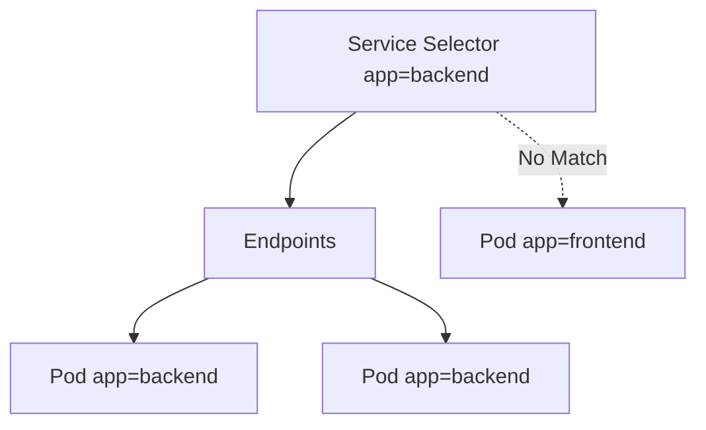

# Endpoints

```mermaid
flowchart TD
    Service[Service Selector app=backend]
    Endpoints[Endpoints]
    Pod1[Pod app=backend]
    Pod2[Pod app=backend]
    Pod3[Pod app=frontend]

    Service --> Endpoints
    Endpoints --> Pod1
    Endpoints --> Pod2
    Service -. No Match .-> Pod3
```

## Key Point

Endpoints are created from Pods whose labels match the Service selector.

If a Service has no Endpoints, traffic cannot reach backend Pods.
