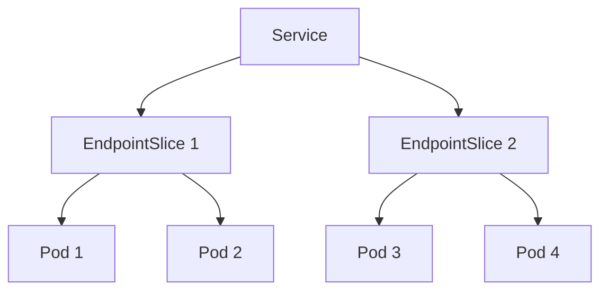

# EndpointSlice

```mermaid
flowchart TD
    Service[Service]
    Slice1[EndpointSlice 1]
    Slice2[EndpointSlice 2]
    Pod1[Pod 1]
    Pod2[Pod 2]
    Pod3[Pod 3]
    Pod4[Pod 4]

    Service --> Slice1
    Service --> Slice2
    Slice1 --> Pod1
    Slice1 --> Pod2
    Slice2 --> Pod3
    Slice2 --> Pod4
```

## Key Point

EndpointSlices improve scalability by splitting endpoint data into smaller groups.
