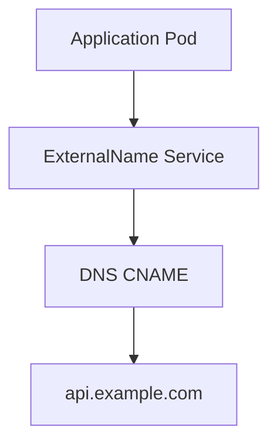

# ExternalName

```mermaid
flowchart TD
    Pod[Application Pod]
    Service[ExternalName Service]
    DNS[DNS CNAME]
    External[api.example.com]

    Pod --> Service
    Service --> DNS
    DNS --> External
```

## Key Point

ExternalName maps a Kubernetes Service name to an external DNS name. It does not proxy traffic.
