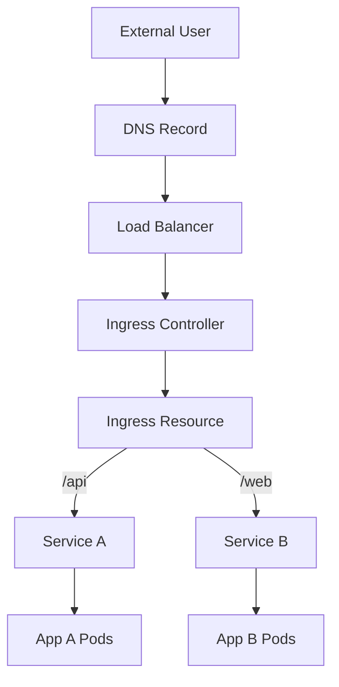

# Ingress

```mermaid
flowchart TD
    User[External User]
    DNS[DNS Record]
    LB[Load Balancer]
    Controller[Ingress Controller]
    Ingress[Ingress Resource]
    ServiceA[Service A]
    ServiceB[Service B]
    PodA[App A Pods]
    PodB[App B Pods]

    User --> DNS
    DNS --> LB
    LB --> Controller
    Controller --> Ingress
    Ingress -->|/api| ServiceA
    Ingress -->|/web| ServiceB
    ServiceA --> PodA
    ServiceB --> PodB
```

## Key Point

Ingress routes HTTP and HTTPS traffic to Services based on host or path rules.
