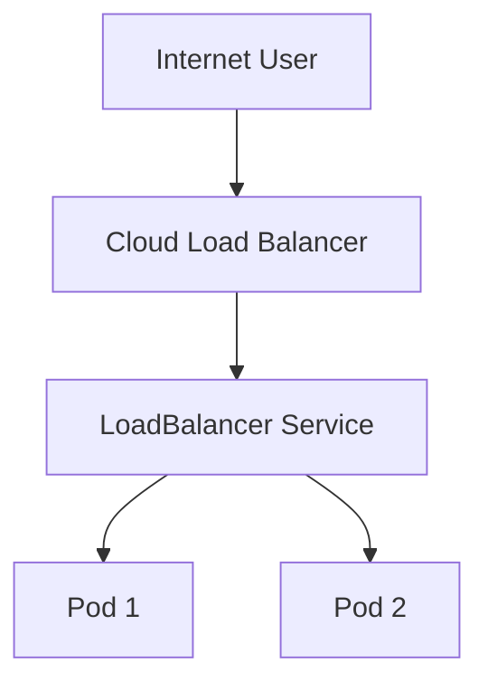

# LoadBalancer

```mermaid
flowchart TD
    User[Internet User]
    LB[Cloud Load Balancer]
    Service[LoadBalancer Service]
    Pod1[Pod 1]
    Pod2[Pod 2]

    User --> LB
    LB --> Service
    Service --> Pod1
    Service --> Pod2
```

## Key Point

LoadBalancer Services expose applications externally using a cloud provider load balancer.
