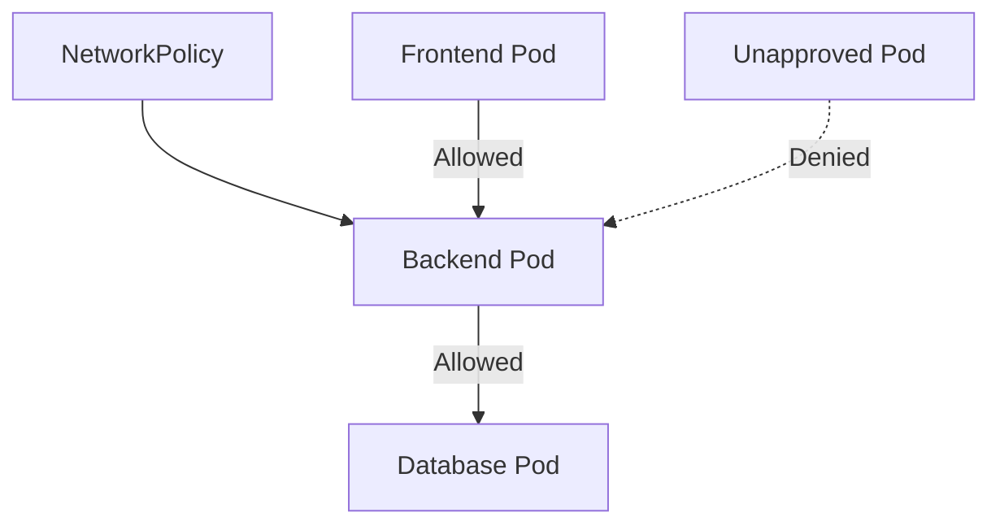

# NetworkPolicy

```mermaid
flowchart TD
    Frontend[Frontend Pod]
    Backend[Backend Pod]
    Database[Database Pod]
    Blocked[Unapproved Pod]
    Policy[NetworkPolicy]

    Policy --> Backend
    Frontend -->|Allowed| Backend
    Backend -->|Allowed| Database
    Blocked -. Denied .-> Backend
```

## Key Point

NetworkPolicies control allowed Pod-to-Pod communication.
