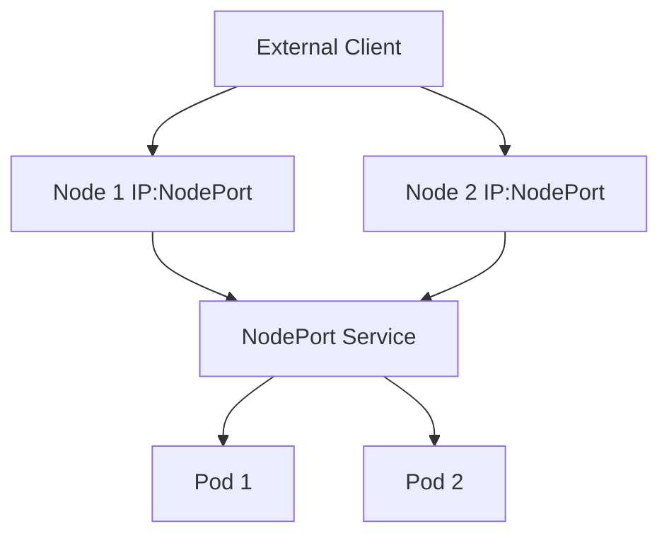

# NodePort

```mermaid
flowchart TD
    Client[External Client]
    Node1[Node 1 IP:NodePort]
    Node2[Node 2 IP:NodePort]
    Service[NodePort Service]
    Pod1[Pod 1]
    Pod2[Pod 2]

    Client --> Node1
    Client --> Node2
    Node1 --> Service
    Node2 --> Service
    Service --> Pod1
    Service --> Pod2
```

## Key Point

NodePort exposes a Service on a port across every node.
