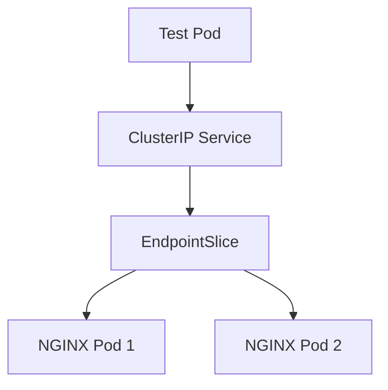

# Lab 01 - ClusterIP Service

## Difficulty

⭐ Beginner

## Estimated Time

20–30 minutes

---

# CKA Objectives Covered

* Create a Deployment
* Create a ClusterIP Service
* Verify Service connectivity
* Understand Endpoints and EndpointSlices
* Troubleshoot Service communication

---

# Objective

In this lab, you will:

* Deploy an NGINX application.
* Expose it using a ClusterIP Service.
* Verify that traffic reaches the Pods.
* Understand how Services route traffic.

---

# Architecture



---

# Step 1 - Create a Deployment

Create an NGINX Deployment with two replicas.

```bash
kubectl create deployment nginx \
  --image=nginx \
  --replicas=2
```

Verify:

```bash
kubectl get deployment

kubectl get pods -o wide
```

Expected:

* Deployment is available.
* Two Pods are running.

---

# Step 2 - Create a ClusterIP Service

Expose the Deployment.

```bash
kubectl expose deployment nginx \
  --name=nginx-service \
  --port=80 \
  --target-port=80
```

Verify:

```bash
kubectl get svc
```

Expected output:

```text
NAME            TYPE        CLUSTER-IP      EXTERNAL-IP   PORT(S)

nginx-service   ClusterIP   10.xx.xx.xx     <none>        80/TCP
```

---

# Step 3 - Verify Endpoints

Check that the Service discovered the Pods.

```bash
kubectl get endpoints nginx-service

kubectl get endpointslice
```

Expected:

The Service should list both backend Pods.

---

# Step 4 - Test Connectivity

Launch a temporary BusyBox Pod.

```bash
kubectl run test-client \
  --image=busybox:1.36 \
  --restart=Never \
  -it --rm -- sh
```

Inside the container run:

```sh
wget -qO- http://nginx-service
```

You should receive the default NGINX HTML page.

---

# Step 5 - Verify DNS Resolution

Inside the BusyBox Pod:

```sh
nslookup nginx-service
```

Expected:

The Service name resolves to the ClusterIP.

---

# Step 6 - Describe the Service

```bash
kubectl describe svc nginx-service
```

Review:

* Selector
* ClusterIP
* Port
* Endpoints

---

# Step 7 - Break the Service

Edit the Service:

```bash
kubectl edit svc nginx-service
```

Change:

```yaml
selector:
  app: nginx
```

to

```yaml
selector:
  app: backend
```

Save the changes.

---

# Step 8 - Verify Failure

Check Endpoints:

```bash
kubectl get endpoints nginx-service
```

Expected:

```text
ENDPOINTS

<none>
```

Now launch BusyBox again:

```bash
kubectl run test-client \
  --image=busybox:1.36 \
  --restart=Never \
  -it --rm -- sh
```

Test:

```sh
wget -qO- http://nginx-service
```

The request should fail because the Service has no backend Pods.

---

# Step 9 - Fix the Service

Restore the selector:

```yaml
selector:
  app: nginx
```

Verify:

```bash
kubectl get endpoints nginx-service
```

The backend Pods should appear again.

Test:

```bash
kubectl run test-client \
  --image=busybox:1.36 \
  --restart=Never \
  -it --rm -- sh
```

```sh
wget -qO- http://nginx-service
```

The request should succeed.

---

# Verification Checklist

✅ Deployment created.

✅ ClusterIP Service created.

✅ Service DNS resolved.

✅ Endpoints verified.

✅ Selector mismatch reproduced.

✅ Service restored successfully.

---

# Common Errors

## Service Has No Endpoints

Verify:

```bash
kubectl get endpoints nginx-service

kubectl describe svc nginx-service

kubectl get pods --show-labels
```

Most common cause:

Service selector does not match Pod labels.

---

## DNS Lookup Fails

Verify:

```bash
kubectl get pods -n kube-system

kubectl logs -n kube-system deployment/coredns
```

---

## Service Exists but No Traffic

Verify:

```bash
kubectl get pods

kubectl describe pod <pod-name>
```

Ensure Pods are **Ready**, not just **Running**.

---

# Production Discussion

ClusterIP is the default Service type.

Typical use cases:

* Internal APIs
* Databases
* Microservices
* Backend communication

Applications should always communicate using the Service DNS name instead of Pod IP addresses.

---

# Knowledge Check

1. What is the default Kubernetes Service type?
2. Why should applications use Service names instead of Pod IPs?
3. What creates the list of backend Pods for a Service?
4. What happens if Endpoints are empty?
5. Which command verifies Service DNS resolution?

---

# Cleanup

```bash
kubectl delete svc nginx-service

kubectl delete deployment nginx
```

---

# Challenge

1. Deploy an application with three replicas.
2. Create a ClusterIP Service.
3. Verify the Service DNS.
4. Confirm that all Pods appear in the Endpoints.
5. Break the selector intentionally.
6. Observe that Endpoints become empty.
7. Fix the selector and verify traffic is restored.
