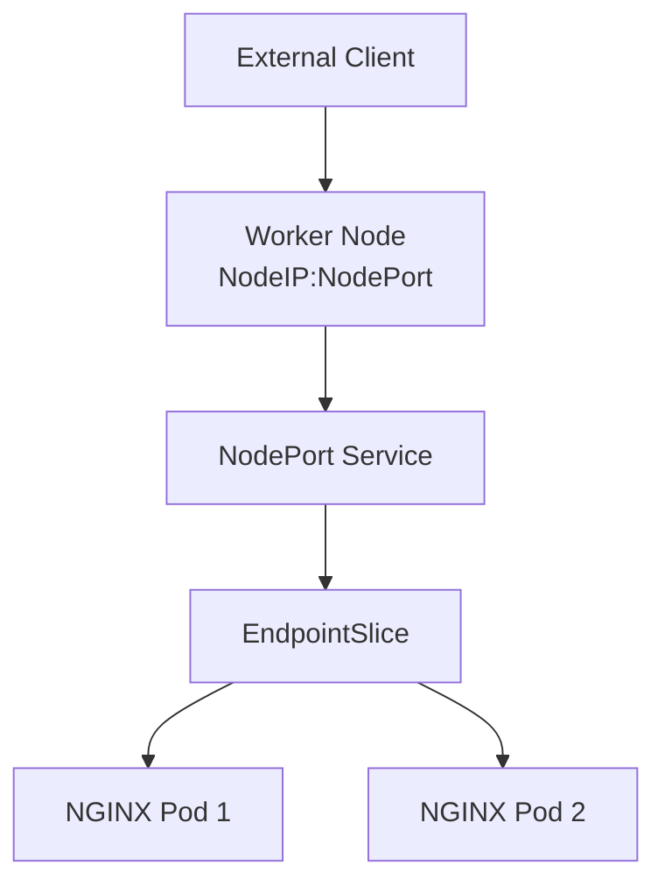

# Lab 02 - NodePort Service

## Difficulty

⭐ Beginner

## Estimated Time

20–30 minutes

---

# CKA Objectives Covered

* Create a NodePort Service
* Access an application from outside the cluster
* Verify Service routing
* Understand NodePort architecture
* Troubleshoot NodePort connectivity

---

# Objective

In this lab, you will:

* Deploy an NGINX application.
* Expose it using a NodePort Service.
* Access the application from outside the cluster.
* Understand how NodePort routes traffic.

---

# Architecture



---

# Step 1 - Create a Deployment

```bash
kubectl create deployment nginx \
  --image=nginx \
  --replicas=2
```

Verify:

```bash
kubectl get deployment

kubectl get pods -o wide
```

Expected:

* Deployment available.
* Two Pods running.

---

# Step 2 - Create a NodePort Service

```bash
kubectl expose deployment nginx \
  --name=nginx-nodeport \
  --type=NodePort \
  --port=80 \
  --target-port=80
```

Verify:

```bash
kubectl get svc
```

Example:

```text
NAME              TYPE       CLUSTER-IP      EXTERNAL-IP   PORT(S)

nginx-nodeport    NodePort   10.96.25.10     <none>        80:31234/TCP
```

---

# Step 3 - View the Assigned NodePort

```bash
kubectl describe svc nginx-nodeport
```

Observe:

```text
NodePort:

31234/TCP
```

Your NodePort will likely be different.

---

# Step 4 - Find the Node IP

```bash
kubectl get nodes -o wide
```

Example:

```text
INTERNAL-IP

192.168.49.2
```

For cloud clusters, use the external node IP if available.

---

# Step 5 - Access the Application

Open your browser:

```text
http://<Node-IP>:<NodePort>
```

Example:

```text
http://192.168.49.2:31234
```

Expected:

NGINX welcome page.

---

# Step 6 - Test from the Command Line

```bash
curl http://<Node-IP>:<NodePort>
```

or

```bash
wget -qO- http://<Node-IP>:<NodePort>
```

---

# Step 7 - Verify Endpoints

```bash
kubectl get endpoints nginx-nodeport

kubectl get endpointslice
```

Confirm that both Pods appear.

---

# Step 8 - Describe the Service

```bash
kubectl describe svc nginx-nodeport
```

Review:

* Type
* ClusterIP
* NodePort
* Selector
* Endpoints

---

# Step 9 - Test Load Balancing

Increase the number of replicas.

```bash
kubectl scale deployment nginx \
  --replicas=4
```

Verify:

```bash
kubectl get pods
```

Check Endpoints:

```bash
kubectl get endpoints nginx-nodeport
```

Observe:

All four Pods become backend endpoints.

---

# Verification Checklist

✅ Deployment created.

✅ NodePort Service created.

✅ NodePort identified.

✅ Application accessible externally.

✅ Endpoints verified.

✅ Scaling verified.

---

# Common Errors

## Cannot Access NodePort

Verify:

```bash
kubectl get svc

kubectl describe svc nginx-nodeport

kubectl get pods

kubectl get endpoints nginx-nodeport
```

Possible causes:

* Wrong Node IP
* Wrong NodePort
* Firewall blocking traffic
* Pods not Ready

---

## Service Has No Endpoints

Verify:

```bash
kubectl get endpoints nginx-nodeport

kubectl get pods --show-labels
```

Most common cause:

Service selector mismatch.

---

## NodePort Works Internally but Not Externally

Possible causes:

* Cloud firewall
* Local VM networking
* Security Groups
* Node not reachable

---

# Production Discussion

NodePort is useful for:

* Home labs
* Learning Kubernetes
* Development clusters
* Temporary testing

In production, NodePort is usually placed behind:

* LoadBalancer
* Ingress Controller

---

# Knowledge Check

1. What is NodePort?
2. Which Service type exposes an application on every node?
3. Does every node listen on the assigned NodePort?
4. What is the default NodePort range?
5. Why is NodePort less common in production?

---

# Cleanup

```bash
kubectl delete svc nginx-nodeport

kubectl delete deployment nginx
```

---

# Challenge

1. Deploy an application with three replicas.
2. Create a NodePort Service.
3. Access it using the Node IP and NodePort.
4. Scale the Deployment to five replicas.
5. Verify that all Pods appear as Endpoints.
6. Explain how NodePort differs from ClusterIP.
