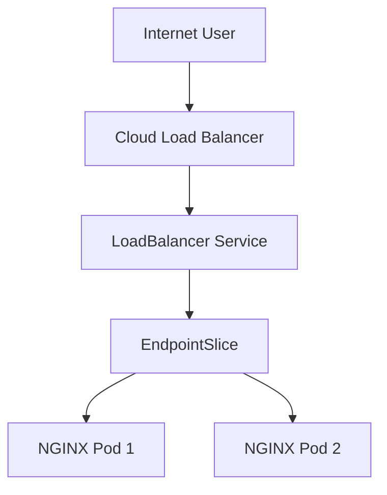

# Lab 03 - LoadBalancer Service

## Difficulty

⭐⭐ Intermediate

## Estimated Time

20–30 minutes

---

# CKA Objectives Covered

* Create a LoadBalancer Service
* Understand cloud load balancer integration
* Verify external access
* Troubleshoot EXTERNAL-IP issues
* Compare LoadBalancer with NodePort

---

# Objective

In this lab, you will:

* Deploy an NGINX application.
* Expose it using a LoadBalancer Service.
* Understand how cloud providers provision external load balancers.
* Learn why local clusters often display `EXTERNAL-IP: <pending>`.

---

# Architecture



---

# Step 1 - Create a Deployment

Deploy an NGINX application with two replicas.

```bash
kubectl create deployment nginx \
  --image=nginx \
  --replicas=2
```

Verify:

```bash
kubectl get deployment

kubectl get pods -o wide
```

---

# Step 2 - Create a LoadBalancer Service

Expose the Deployment.

```bash
kubectl expose deployment nginx \
  --name=nginx-lb \
  --type=LoadBalancer \
  --port=80 \
  --target-port=80
```

Verify:

```bash
kubectl get svc
```

Expected:

```text
NAME         TYPE           CLUSTER-IP      EXTERNAL-IP   PORT(S)

nginx-lb     LoadBalancer   10.xx.xx.xx     <pending>     80:31xxx/TCP
```

---

# Step 3 - Understand EXTERNAL-IP

## Cloud Kubernetes

Examples:

* Amazon EKS
* Azure AKS
* Google GKE

Expected:

```text
EXTERNAL-IP

34.xxx.xxx.xxx
```

or

```text
abc123.us-east-1.elb.amazonaws.com
```

---

## Local Kubernetes

Examples:

* Kind
* Minikube
* Docker Desktop

Expected:

```text
EXTERNAL-IP

<pending>
```

This is normal because no cloud load balancer exists.

---

# Step 4 - Verify Endpoints

```bash
kubectl get endpoints nginx-lb

kubectl get endpointslice
```

Both backend Pods should appear.

---

# Step 5 - Describe the Service

```bash
kubectl describe svc nginx-lb
```

Review:

* Type
* ClusterIP
* NodePort
* External IP
* Selector
* Endpoints

Notice that a LoadBalancer Service also allocates a NodePort.

---

# Step 6 - Test External Access

## Cloud Cluster

Open:

```text
http://<EXTERNAL-IP>
```

or

```text
http://<LOADBALANCER-DNS>
```

You should see the NGINX welcome page.

---

## Local Cluster

If using MetalLB:

```bash
kubectl get svc
```

Open:

```text
http://<METALLB-IP>
```

If MetalLB is not installed, the Service will remain in the Pending state.

---

# Step 7 - Scale the Deployment

Increase replicas.

```bash
kubectl scale deployment nginx \
  --replicas=4
```

Verify:

```bash
kubectl get pods

kubectl get endpoints nginx-lb
```

Observe:

All Pods are automatically added as backend endpoints.

---

# Verification Checklist

✅ Deployment created.

✅ LoadBalancer Service created.

✅ Service verified.

✅ Endpoints verified.

✅ Scaling verified.

✅ EXTERNAL-IP behavior understood.

---

# Common Errors

## EXTERNAL-IP Remains Pending

Verify:

```bash
kubectl get svc

kubectl describe svc nginx-lb
```

Possible causes:

* Local cluster
* No cloud provider integration
* MetalLB not installed

---

## Service Has No Endpoints

Verify:

```bash
kubectl get endpoints nginx-lb

kubectl get pods --show-labels
```

Most common cause:

Service selector does not match Pod labels.

---

## Cannot Access Application

Verify:

```bash
kubectl get pods

kubectl get svc

kubectl describe svc nginx-lb
```

Check:

* Pod readiness
* Firewall rules
* Cloud security groups
* Load balancer health

---

# Production Discussion

LoadBalancer Services are commonly used for:

* Public APIs
* Web applications
* External services
* Production workloads

On managed Kubernetes platforms, creating a LoadBalancer Service automatically provisions a cloud load balancer.

Internally, a LoadBalancer Service still relies on a NodePort and ClusterIP Service.

---

# Real World Notes

* A LoadBalancer Service automatically creates a ClusterIP.
* A LoadBalancer Service also allocates a NodePort.
* Cloud load balancers forward traffic to the NodePort.
* Most cloud Kubernetes platforms automate the entire process.
* Local clusters require a solution such as MetalLB to provide LoadBalancer functionality.

---

# Knowledge Check

1. What creates the external load balancer for a LoadBalancer Service?
2. Why does `EXTERNAL-IP` remain `Pending` on many local clusters?
3. Does a LoadBalancer Service also create a ClusterIP?
4. Does a LoadBalancer Service allocate a NodePort?
5. When should you choose a LoadBalancer Service over a NodePort Service?

---

# Cleanup

```bash
kubectl delete svc nginx-lb

kubectl delete deployment nginx
```

---

# Challenge

1. Deploy an application with three replicas.
2. Create a LoadBalancer Service.
3. Verify the assigned ClusterIP.
4. Verify the allocated NodePort.
5. Observe the EXTERNAL-IP.
6. Explain why it is available (or pending) in your environment.
7. Scale the Deployment to five replicas and verify the Endpoints update automatically.
