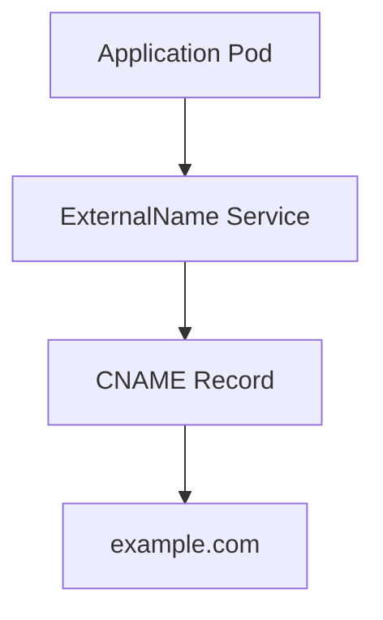

# Lab 04 - ExternalName Service

## Difficulty

⭐⭐ Intermediate

## Estimated Time

15–20 minutes

---

# CKA Objectives Covered

* Create an ExternalName Service
* Understand DNS aliasing
* Verify ExternalName resolution
* Compare ExternalName with other Service types
* Troubleshoot ExternalName Services

---

# Objective

In this lab, you will:

* Create an ExternalName Service.
* Map it to an external DNS name.
* Verify DNS resolution.
* Understand why ExternalName does not create Endpoints or a ClusterIP.

---

# Architecture



---

# What is an ExternalName Service?

Unlike other Kubernetes Services, an ExternalName Service does **not**:

* Create a ClusterIP
* Create Endpoints
* Load balance traffic
* Proxy requests

Instead, it creates a DNS alias (CNAME) that points to an external hostname.

---

# Step 1 - Create the ExternalName Service

Create a file named:

```text id="qp6jvw"
externalname.yaml
```

```yaml id="n7x5fh"
apiVersion: v1
kind: Service

metadata:
  name: external-google

spec:
  type: ExternalName
  externalName: www.google.com
```

Apply the manifest:

```bash id="b8r3ya"
kubectl apply -f externalname.yaml
```

---

# Step 2 - Verify the Service

```bash id="y5h2tc"
kubectl get svc
```

Expected output:

```text id="v8p6rx"
NAME              TYPE

external-google   ExternalName
```

Describe the Service:

```bash id="c4w1ze"
kubectl describe svc external-google
```

Observe:

* Type: ExternalName
* ExternalName: [www.google.com](http://www.google.com)

Notice there is **no ClusterIP**.

---

# Step 3 - Verify No Endpoints Exist

Run:

```bash id="d2n9fk"
kubectl get endpoints external-google
```

Expected:

```text id="s4q7lm"
No resources found
```

This is expected because ExternalName Services do not create Endpoints.

---

# Step 4 - Launch a Test Pod

Create a temporary BusyBox Pod:

```bash id="g6v3rp"
kubectl run dns-test \
  --image=busybox:1.36 \
  --restart=Never \
  -it --rm -- sh
```

---

# Step 5 - Resolve the ExternalName Service

Inside the BusyBox Pod:

```sh id="w1m8jd"
nslookup external-google
```

Expected:

The response shows a CNAME pointing to:

```text id="j7c2na"
www.google.com
```

You may also see the final IP address returned by the upstream DNS server.

---

# Step 6 - Test Connectivity

Inside the BusyBox Pod:

```sh id="f5z9kh"
wget -qO- https://www.google.com
```

or

```sh id="r8n4tv"
wget -qO- http://external-google
```

Depending on your environment, HTTPS requests may require additional BusyBox utilities. The important observation is that DNS resolution works through the ExternalName alias.

---

# Verification Checklist

✅ ExternalName Service created.

✅ Service verified.

✅ No ClusterIP assigned.

✅ No Endpoints created.

✅ DNS alias resolved successfully.

---

# Common Errors

## Service Does Not Resolve

Verify:

```bash id="k3x6yp"
kubectl get svc

kubectl describe svc external-google
```

Ensure the external hostname is valid.

---

## DNS Lookup Fails

Verify:

```bash id="t9r2bw"
kubectl get pods -n kube-system

kubectl logs -n kube-system deployment/coredns
```

Confirm that CoreDNS is running correctly.

---

## Expecting a ClusterIP

ExternalName Services intentionally do **not** receive a ClusterIP.

Verify:

```bash id="u6f8ql"
kubectl get svc external-google
```

The `CLUSTER-IP` field should display:

```text id="e4w1nx"
<none>
```

---

# ExternalName vs Other Service Types

| Feature           | ClusterIP | NodePort | LoadBalancer | ExternalName |
| ----------------- | --------- | -------- | ------------ | ------------ |
| ClusterIP         | ✅         | ✅        | ✅            | ❌            |
| Endpoints         | ✅         | ✅        | ✅            | ❌            |
| Load Balancing    | ✅         | ✅        | ✅            | ❌            |
| DNS Alias         | ❌         | ❌        | ❌            | ✅            |
| External Resource | ❌         | ❌        | ❌            | ✅            |

---

# Production Discussion

ExternalName Services are useful when:

* Accessing external databases.
* Connecting to third-party APIs.
* Migrating legacy applications.
* Providing a consistent Service name for external resources.

Example:

Instead of applications connecting directly to:

```text id="g9k5rh"
database.company.com
```

They connect to:

```text id="n2v7sy"
database-service
```

If the external hostname changes, only the ExternalName Service needs updating.

---

# Real World Notes

* ExternalName creates a DNS CNAME record.
* Kubernetes does not proxy or load balance the traffic.
* No kube-proxy rules are created.
* No Endpoint or EndpointSlice objects are generated.

---

# Knowledge Check

1. What is an ExternalName Service?
2. Does it create a ClusterIP?
3. Does it create Endpoints?
4. What DNS record type does it create?
5. When would you use an ExternalName Service in production?

---

# Cleanup

```bash id="h5t8mw"
kubectl delete svc external-google
```

---

# Challenge

1. Create an ExternalName Service pointing to another public website.
2. Verify the Service using `kubectl describe`.
3. Confirm that no Endpoints or ClusterIP are created.
4. Resolve the Service name from a BusyBox Pod.
5. Explain how ExternalName differs from ClusterIP and LoadBalancer Services.
