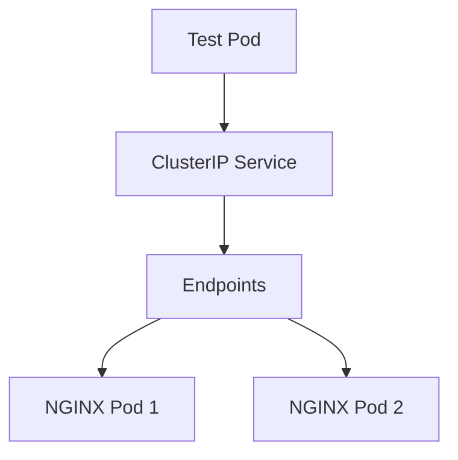

# Lab 05 - Endpoints

## Difficulty

⭐⭐ Intermediate

## Estimated Time

25–35 minutes

---

# CKA Objectives Covered

* Understand Kubernetes Endpoints
* Verify Service-to-Pod mapping
* Troubleshoot selector mismatches
* Observe automatic Endpoint updates
* Understand Service discovery

---

# Objective

In this lab, you will:

* Create a Deployment.
* Create a ClusterIP Service.
* Verify the Endpoints object.
* Observe how Endpoints change as Pods scale.
* Intentionally break the Service selector and troubleshoot the issue.

---

# Architecture



---

# What are Endpoints?

Endpoints are automatically created by Kubernetes.

They contain the IP addresses of Pods that match a Service selector.

Traffic flow:

```text id="5yjwvv"
Client
   │
   ▼
Service
   │
   ▼
Endpoints
   │
   ▼
Pods
```

Without Endpoints, a Service has nowhere to send traffic.

---

# Step 1 - Create a Deployment

```bash id="w7v6nm"
kubectl create deployment nginx \
  --image=nginx \
  --replicas=2
```

Verify:

```bash id="v6zdgf"
kubectl get deployment

kubectl get pods -o wide
```

---

# Step 2 - Create a ClusterIP Service

```bash id="4rcsuw"
kubectl expose deployment nginx \
  --name=nginx-service \
  --port=80 \
  --target-port=80
```

Verify:

```bash id="4zjlwm"
kubectl get svc
```

---

# Step 3 - View Endpoints

```bash id="khsr5m"
kubectl get endpoints
```

Example:

```text id="0xg7sd"
NAME             ENDPOINTS

nginx-service    10.244.0.10:80,10.244.0.11:80
```

Describe the Endpoints:

```bash id="q6d1o6"
kubectl describe endpoints nginx-service
```

---

# Step 4 - Verify Service Connectivity

Create a temporary BusyBox Pod:

```bash id="mgjlwm"
kubectl run test-client \
  --image=busybox:1.36 \
  --restart=Never \
  -it --rm -- sh
```

Inside the Pod:

```sh id="9mguzs"
wget -qO- http://nginx-service
```

You should receive the NGINX welcome page.

---

# Step 5 - Scale the Deployment

Increase the replicas:

```bash id="tdjlwm"
kubectl scale deployment nginx \
  --replicas=4
```

Verify:

```bash id="cnz2mu"
kubectl get pods

kubectl get endpoints nginx-service
```

Observe:

All four Pod IPs are automatically added to the Endpoints object.

---

# Step 6 - Break the Service

Edit the Service:

```bash id="nj2bpu"
kubectl edit svc nginx-service
```

Change:

```yaml id="yhg8kp"
selector:
  app: nginx
```

to

```yaml id="vyvdj0"
selector:
  app: backend
```

Save the changes.

---

# Step 7 - Observe the Failure

Check Endpoints:

```bash id="q9wgja"
kubectl get endpoints nginx-service
```

Expected:

```text id="jlwm2g"
ENDPOINTS

<none>
```

Describe the Service:

```bash id="jjlwm3"
kubectl describe svc nginx-service
```

Notice:

The selector no longer matches any Pods.

---

# Step 8 - Fix the Selector

Edit the Service again.

Restore:

```yaml id="jlwm4k"
selector:
  app: nginx
```

Verify:

```bash id="jlwm5n"
kubectl get endpoints nginx-service
```

The Pod IPs should immediately reappear.

---

# Step 9 - Verify Traffic

Launch BusyBox again:

```bash id="jlwm6v"
kubectl run test-client \
  --image=busybox:1.36 \
  --restart=Never \
  -it --rm -- sh
```

Inside:

```sh id="jlwm7q"
wget -qO- http://nginx-service
```

Traffic should work again.

---

# Verification Checklist

✅ Deployment created.

✅ ClusterIP Service created.

✅ Endpoints verified.

✅ Scaling updated Endpoints automatically.

✅ Selector mismatch reproduced.

✅ Service restored.

---

# Common Errors

## Endpoints Are Empty

Verify:

```bash id="jlwm8x"
kubectl get endpoints nginx-service

kubectl describe svc nginx-service

kubectl get pods --show-labels
```

Most common cause:

Service selector does not match Pod labels.

---

## Service Exists but Traffic Fails

Verify:

```bash id="jlwm9m"
kubectl get pods

kubectl describe pod <pod-name>
```

Ensure Pods are **Ready**, not just **Running**.

---

## Endpoints Missing Some Pods

Possible causes:

* Pods are not Ready.
* Pod labels differ.
* Different namespace.

---

# Production Discussion

Endpoints are critical because they connect:

```text id="2bjlwm"
Service

↓

Endpoints

↓

Pods
```

Whenever a Pod is:

* Created
* Deleted
* Restarted
* Marked Ready or NotReady

Kubernetes automatically updates the Endpoints object.

---

# Real World Notes

* Always check Endpoints before debugging DNS.
* Empty Endpoints almost always indicate a selector or readiness issue.
* Services never send traffic directly to Pods; they send traffic to Endpoints.
* EndpointSlice is the scalable replacement for Endpoints in modern Kubernetes clusters.

---

# Knowledge Check

1. What are Kubernetes Endpoints?
2. How are Endpoints created?
3. What causes Endpoints to become empty?
4. Do Services route traffic directly to Pods?
5. What updates the Endpoints object when Pods are added or removed?

---

# Cleanup

```bash id="jlwm0r"
kubectl delete svc nginx-service

kubectl delete deployment nginx
```

---

# Challenge

1. Deploy an application with three replicas.
2. Create a ClusterIP Service.
3. Verify the Endpoints object.
4. Scale the Deployment to five replicas.
5. Observe the Endpoints update automatically.
6. Break the selector intentionally.
7. Confirm that Endpoints become empty.
8. Restore the selector and verify connectivity.
