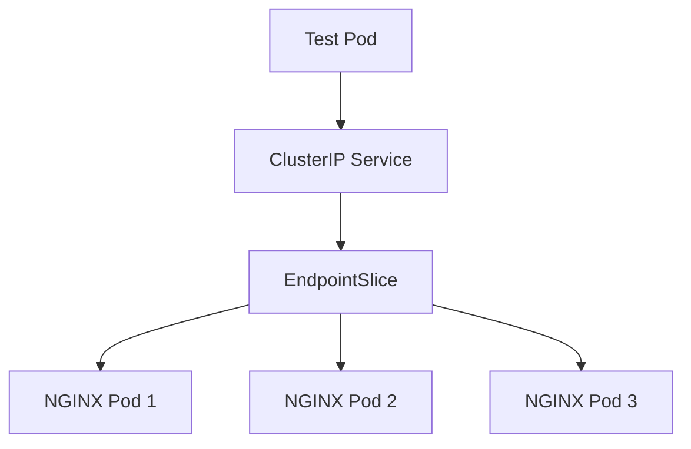

# Lab 06 - EndpointSlice

## Difficulty

⭐⭐ Intermediate

## Estimated Time

20–30 minutes

---

# CKA Objectives Covered

* Understand EndpointSlices
* Compare Endpoints and EndpointSlices
* Verify automatic EndpointSlice creation
* Observe EndpointSlice updates during scaling
* Troubleshoot Service backend discovery

---

# Objective

In this lab, you will:

* Create a Deployment.
* Expose it with a ClusterIP Service.
* View the automatically created EndpointSlice.
* Compare EndpointSlice with Endpoints.
* Observe EndpointSlice updates as Pods scale.

---

# Architecture



---

# What is an EndpointSlice?

EndpointSlice is the modern replacement for the Endpoints resource.

Instead of storing all backend Pods in a single object, Kubernetes distributes them across one or more EndpointSlices.

Benefits:

* Better scalability
* Reduced API server load
* Faster updates
* Improved performance in large clusters

---

# Step 1 - Create a Deployment

```bash id="h8g4dt"
kubectl create deployment nginx \
  --image=nginx \
  --replicas=3
```

Verify:

```bash id="kp9r41"
kubectl get deployment

kubectl get pods -o wide
```

---

# Step 2 - Create a ClusterIP Service

```bash id="ew5jra"
kubectl expose deployment nginx \
  --name=nginx-service \
  --port=80 \
  --target-port=80
```

Verify:

```bash id="v7tj6p"
kubectl get svc
```

---

# Step 3 - View the EndpointSlice

List EndpointSlices:

```bash id="r0fj7x"
kubectl get endpointslice
```

Expected:

```text id="m4pj91"
NAME

nginx-service-xxxxx
```

Describe the EndpointSlice:

```bash id="f3v8sd"
kubectl describe endpointslice <endpointslice-name>
```

Review:

* Address type
* Ports
* Endpoint IPs
* Ready status

---

# Step 4 - Compare with Endpoints

View both resources:

```bash id="6d2kfp"
kubectl get endpoints nginx-service

kubectl get endpointslice
```

Observe:

* Endpoints contain all backend IPs in one object.
* EndpointSlice organizes backend IPs in a scalable structure.

---

# Step 5 - Scale the Deployment

Increase replicas:

```bash id="9q1vzx"
kubectl scale deployment nginx \
  --replicas=6
```

Verify:

```bash id="z7uw2y"
kubectl get pods

kubectl get endpoints nginx-service

kubectl get endpointslice
```

Observe:

The EndpointSlice is updated automatically.

Large applications may use multiple EndpointSlices.

---

# Step 6 - View EndpointSlice YAML

```bash id="j2c8tf"
kubectl get endpointslice <endpointslice-name> -o yaml
```

Review:

* addresses
* conditions
* ports
* targetRef

---

# Step 7 - Test Connectivity

Launch a temporary BusyBox Pod:

```bash id="8x1mwd"
kubectl run test-client \
  --image=busybox:1.36 \
  --restart=Never \
  -it --rm -- sh
```

Inside the Pod:

```sh id="w4d6nu"
wget -qO- http://nginx-service
```

Traffic should reach one of the backend Pods.

---

# Verification Checklist

✅ Deployment created.

✅ ClusterIP Service created.

✅ EndpointSlice discovered.

✅ Endpoints compared.

✅ Scaling verified.

✅ Connectivity tested.

---

# Common Errors

## No EndpointSlice Found

Verify:

```bash id="4y9n2g"
kubectl get svc

kubectl get endpointslice
```

Ensure the Service was created successfully.

---

## EndpointSlice Has No Endpoints

Verify:

```bash id="q5t8kh"
kubectl get pods --show-labels

kubectl describe svc nginx-service

kubectl get endpoints
```

Most common cause:

Service selector does not match Pod labels.

---

## Traffic Fails

Verify:

```bash id="m6c3rb"
kubectl get endpoints

kubectl get endpointslice

kubectl describe pod <pod-name>
```

Ensure Pods are **Ready**.

---

# Production Discussion

Modern Kubernetes clusters rely on EndpointSlices because they scale much better than the legacy Endpoints resource.

For small clusters, both resources appear similar.

For large clusters with hundreds or thousands of Pods, EndpointSlices significantly reduce API server load and improve performance.

---

# Endpoints vs EndpointSlice

| Feature        | Endpoints | EndpointSlice |
| -------------- | --------- | ------------- |
| Legacy         | ✅         | ❌             |
| Recommended    | ❌         | ✅             |
| Scalability    | Limited   | Excellent     |
| API Efficiency | Lower     | Higher        |
| Automatic      | ✅         | ✅             |

---

# Real World Notes

* EndpointSlices are created automatically.
* You normally do not edit them manually.
* Services use EndpointSlices internally for backend discovery.
* Most production clusters use EndpointSlices by default.

---

# Knowledge Check

1. Why were EndpointSlices introduced?
2. How do EndpointSlices improve scalability?
3. Does Kubernetes create EndpointSlices automatically?
4. Can a Service have multiple EndpointSlices?
5. Should you manually edit EndpointSlices?

---

# Cleanup

```bash id="s9e1fy"
kubectl delete svc nginx-service

kubectl delete deployment nginx
```

---

# Challenge

1. Deploy an application with six replicas.
2. Create a ClusterIP Service.
3. Compare the Endpoints and EndpointSlice resources.
4. Scale the Deployment to ten replicas.
5. Observe how Kubernetes updates the EndpointSlice automatically.
6. Explain why EndpointSlices are preferred over Endpoints in large clusters.
