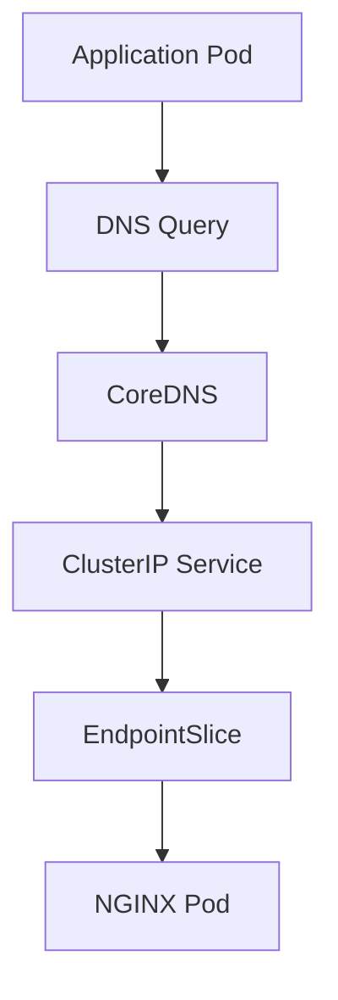

# Lab 07 - Kubernetes DNS

## Difficulty

⭐⭐ Intermediate

## Estimated Time

25–35 minutes

---

# CKA Objectives Covered

* Understand Kubernetes DNS
* Resolve Service names
* Use Fully Qualified Domain Names (FQDN)
* Verify Service discovery
* Troubleshoot DNS issues

---

# Objective

In this lab, you will:

* Create a Deployment.
* Create a ClusterIP Service.
* Verify DNS resolution.
* Compare short names and FQDNs.
* Understand how applications discover Services.

---

# Architecture



---

# What is Kubernetes DNS?

Every Service automatically receives a DNS name.

Applications communicate using the Service name instead of Pod IP addresses.

Example:

```text id="9dbk8u"
nginx-service
```

Fully Qualified Domain Name (FQDN):

```text id="kj5n3m"
nginx-service.default.svc.cluster.local
```

---

# Step 1 - Create a Deployment

```bash id="n5q8ew"
kubectl create deployment nginx \
  --image=nginx \
  --replicas=2
```

Verify:

```bash id="z9x1kt"
kubectl get deployment

kubectl get pods
```

---

# Step 2 - Create a ClusterIP Service

```bash id="p4m6cs"
kubectl expose deployment nginx \
  --name=nginx-service \
  --port=80 \
  --target-port=80
```

Verify:

```bash id="x2v4ry"
kubectl get svc
```

---

# Step 3 - Launch a Test Pod

Start a temporary BusyBox Pod:

```bash id="w3j8an"
kubectl run dns-test \
  --image=busybox:1.36 \
  --restart=Never \
  -it --rm -- sh
```

---

# Step 4 - Resolve the Service Name

Inside the BusyBox Pod:

```sh id="d9k2pm"
nslookup nginx-service
```

Expected:

```text id="8w5rzu"
Server: ...

Name: nginx-service

Address: 10.xx.xx.xx
```

The returned IP is the Service ClusterIP.

---

# Step 5 - Resolve the FQDN

Still inside BusyBox:

```sh id="t6v8ah"
nslookup nginx-service.default.svc.cluster.local
```

Observe:

The result is the same ClusterIP.

---

# Step 6 - Test Connectivity

Inside BusyBox:

```sh id="m4y7cv"
wget -qO- http://nginx-service
```

Expected:

NGINX welcome page HTML.

---

# Step 7 - Inspect DNS Configuration

View the Pod's resolver configuration:

```sh id="u8h2tw"
cat /etc/resolv.conf
```

Example:

```text id="h9j4bp"
search default.svc.cluster.local svc.cluster.local cluster.local

nameserver 10.xx.xx.xx
```

Notice:

* Search domains
* CoreDNS nameserver

---

# Step 8 - Verify Service Discovery

View the Service:

```bash id="g3f9lz"
kubectl get svc nginx-service
```

View Endpoints:

```bash id="p6m2vn"
kubectl get endpoints nginx-service

kubectl get endpointslice
```

Observe:

DNS resolves to the Service, and the Service routes traffic to the backend Pods.

---

# Verification Checklist

✅ Deployment created.

✅ ClusterIP Service created.

✅ Short DNS name resolved.

✅ FQDN resolved.

✅ Connectivity verified.

✅ DNS configuration reviewed.

---

# Common Errors

## nslookup Fails

Verify:

```bash id="v2t7jn"
kubectl get svc

kubectl get pods -n kube-system

kubectl logs -n kube-system deployment/coredns
```

Possible causes:

* CoreDNS unavailable
* Service missing
* Incorrect namespace

---

## DNS Resolves but Traffic Fails

Verify:

```bash id="k7x4qm"
kubectl get endpoints nginx-service

kubectl describe svc nginx-service

kubectl get pods
```

Most common causes:

* Empty Endpoints
* Pods not Ready
* Selector mismatch

---

## Service Name Not Found

Check:

```bash id="j5w9rt"
kubectl get svc -A
```

If the Service is in another namespace, use the FQDN.

---

# Production Discussion

Applications should always communicate using Service DNS names.

Benefits:

* Stable addressing
* No dependency on Pod IPs
* Automatic Service discovery
* Works seamlessly with scaling and rolling updates

---

# Real World Notes

* Every Service automatically gets a DNS record.
* The short Service name works within the same namespace.
* Use the FQDN when accessing Services across namespaces.
* DNS returns the Service IP, not the individual Pod IPs.

---

# DNS Naming Format

| Name                        | Example                                   |
| --------------------------- | ----------------------------------------- |
| Short Name                  | `nginx-service`                           |
| Namespace Qualified         | `nginx-service.default`                   |
| Fully Qualified Domain Name | `nginx-service.default.svc.cluster.local` |

---

# Knowledge Check

1. What component resolves Kubernetes Service names?
2. What does `nslookup nginx-service` return?
3. What is the default Service DNS suffix?
4. When should you use a Service FQDN?
5. Why should applications avoid using Pod IP addresses?

---

# Cleanup

```bash id="y4k8ne"
kubectl delete svc nginx-service

kubectl delete deployment nginx
```

---

# Challenge

1. Deploy an application with three replicas.
2. Create a ClusterIP Service.
3. Resolve the Service using the short name.
4. Resolve the Service using the FQDN.
5. Access the application using `wget`.
6. Inspect `/etc/resolv.conf`.
7. Explain how Kubernetes DNS enables Service discovery.
