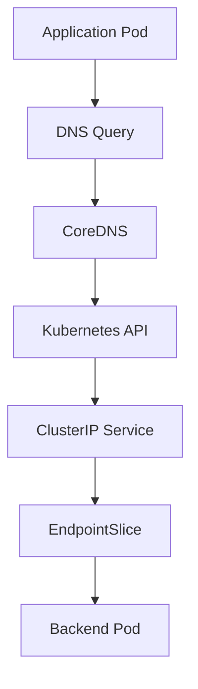

# Lab 08 - CoreDNS

## Difficulty

⭐⭐⭐ Intermediate

## Estimated Time

25–35 minutes

---

# CKA Objectives Covered

* Understand the role of CoreDNS
* Verify CoreDNS deployment
* Inspect CoreDNS configuration
* Test DNS resolution
* Troubleshoot CoreDNS issues

---

# Objective

In this lab, you will:

* Verify the CoreDNS deployment.
* Inspect the CoreDNS ConfigMap.
* Test DNS resolution from a Pod.
* View CoreDNS logs.
* Understand how CoreDNS enables Service discovery.

---

# Architecture



---

# What is CoreDNS?

CoreDNS is the default DNS server in Kubernetes.

Responsibilities:

* Resolve Service names.
* Resolve Pod names (where applicable).
* Cache DNS records.
* Forward external DNS requests.

Without CoreDNS:

* Service discovery does not work.
* Applications cannot resolve Service names.

---

# Step 1 - Verify CoreDNS Pods

```bash
kubectl get pods -n kube-system
```

Look for:

```text
coredns-xxxxxxxxxx-xxxxx
```

Verify:

```bash
kubectl get deployment coredns -n kube-system
```

---

# Step 2 - Inspect the CoreDNS Service

```bash
kubectl get svc -n kube-system
```

Locate:

```text
kube-dns
```

Describe:

```bash
kubectl describe svc kube-dns -n kube-system
```

Observe:

* ClusterIP
* Ports
* Endpoints

---

# Step 3 - Inspect the CoreDNS ConfigMap

```bash
kubectl get configmap coredns \
  -n kube-system \
  -o yaml
```

Locate the **Corefile** section.

Typical configuration:

```text
.:53 {

errors

health

ready

kubernetes cluster.local

forward . /etc/resolv.conf

cache 30

reload
}
```

---

# Step 4 - Create a Test Application

```bash
kubectl create deployment nginx \
  --image=nginx
```

Expose it:

```bash
kubectl expose deployment nginx \
  --name=nginx-service \
  --port=80
```

Verify:

```bash
kubectl get svc
```

---

# Step 5 - Launch a Test Pod

```bash
kubectl run dns-test \
  --image=busybox:1.36 \
  --restart=Never \
  -it --rm -- sh
```

---

# Step 6 - Test DNS Resolution

Inside BusyBox:

```sh
nslookup nginx-service
```

Expected:

```text
Name:

nginx-service

Address:

10.xx.xx.xx
```

Now test the FQDN:

```sh
nslookup nginx-service.default.svc.cluster.local
```

Both commands should resolve to the same ClusterIP.

---

# Step 7 - Inspect DNS Configuration

Inside BusyBox:

```sh
cat /etc/resolv.conf
```

Example:

```text
search default.svc.cluster.local svc.cluster.local cluster.local

nameserver 10.xx.xx.xx
```

Observe:

* Search domains
* DNS server IP

---

# Step 8 - View CoreDNS Logs

```bash
kubectl logs \
  -n kube-system \
  deployment/coredns
```

Review:

* Startup messages
* DNS queries
* Errors

---

# Step 9 - Restart CoreDNS

Restart the Deployment:

```bash
kubectl rollout restart deployment coredns \
  -n kube-system
```

Verify:

```bash
kubectl rollout status deployment coredns \
  -n kube-system
```

Confirm DNS still works:

```bash
kubectl run dns-test \
  --image=busybox:1.36 \
  --restart=Never \
  -it --rm -- sh
```

```sh
nslookup nginx-service
```

---

# Verification Checklist

✅ CoreDNS Pods verified.

✅ kube-dns Service inspected.

✅ ConfigMap reviewed.

✅ DNS resolution verified.

✅ Logs inspected.

✅ Restart tested.

---

# Common Errors

## DNS Lookup Fails

Verify:

```bash
kubectl get pods -n kube-system

kubectl logs -n kube-system deployment/coredns
```

---

## CoreDNS Pods Not Running

Investigate:

```bash
kubectl describe deployment coredns \
  -n kube-system
```

Check:

* Events
* Image pull issues
* Scheduling failures

---

## Service Name Does Not Resolve

Verify:

```bash
kubectl get svc

kubectl get endpoints

kubectl get endpointslice
```

Possible causes:

* Service missing
* Empty Endpoints
* Incorrect namespace

---

# Production Discussion

CoreDNS is a critical component of every Kubernetes cluster.

If CoreDNS becomes unavailable:

* Service discovery fails.
* Applications using Service names cannot communicate.
* Many workloads experience cascading failures.

Production best practices:

* Run multiple CoreDNS replicas.
* Monitor CoreDNS health.
* Monitor DNS latency and error rates.
* Avoid unnecessary CoreDNS configuration changes.

---

# Real World Notes

* CoreDNS usually runs as a Deployment in the `kube-system` namespace.
* The Service is typically named `kube-dns` for backward compatibility.
* CoreDNS queries the Kubernetes API to build DNS records.
* External DNS requests are forwarded to upstream DNS servers.

---

# Knowledge Check

1. What is CoreDNS?
2. Which namespace contains the CoreDNS Deployment?
3. Why is the Service named `kube-dns`?
4. What file stores the CoreDNS configuration?
5. What happens if CoreDNS is unavailable?

---

# Cleanup

```bash
kubectl delete svc nginx-service

kubectl delete deployment nginx
```

---

# Challenge

1. Verify the CoreDNS Deployment.
2. Inspect the CoreDNS ConfigMap.
3. Resolve a Service using both its short name and FQDN.
4. View the CoreDNS logs.
5. Restart the CoreDNS Deployment.
6. Verify DNS resolution still works.
7. Explain the complete DNS resolution flow from a Pod to a backend Service.
