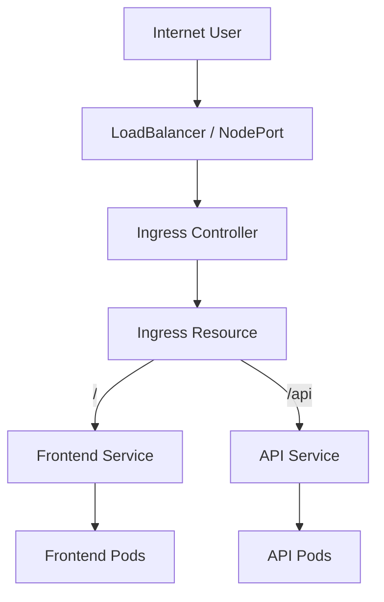

# Lab 09 - Ingress

## Difficulty

⭐⭐⭐ Advanced

## Estimated Time

35–45 minutes

---

# CKA Objectives Covered

* Create an Ingress resource
* Understand Ingress Controllers
* Configure path-based routing
* Verify Ingress traffic
* Troubleshoot Ingress issues

---

# Objective

In this lab, you will:

* Deploy two applications.
* Expose them using ClusterIP Services.
* Create an Ingress resource.
* Configure path-based routing.
* Verify HTTP routing through the Ingress Controller.

---

# Architecture



---

# What is Ingress?

Ingress is a Kubernetes resource that defines HTTP and HTTPS routing rules.

Ingress itself **does not process traffic**.

Traffic is handled by an **Ingress Controller** such as:

* NGINX Ingress Controller
* HAProxy Ingress
* Traefik
* Kong
* AWS Load Balancer Controller

---

# Step 1 - Verify the Ingress Controller

```bash id="5bz8mu"
kubectl get pods -n ingress-nginx
```

Verify:

```bash id="f6u2h3"
kubectl get svc -n ingress-nginx
```

If no controller exists, install one before continuing.

---

# Step 2 - Create Two Deployments

Frontend:

```bash id="x4k7rv"
kubectl create deployment frontend \
  --image=nginx
```

API:

```bash id="6g9twj"
kubectl create deployment api \
  --image=nginx
```

Verify:

```bash id="h7q2zk"
kubectl get deployments

kubectl get pods
```

---

# Step 3 - Create ClusterIP Services

Frontend:

```bash id="k9v8dw"
kubectl expose deployment frontend \
  --name=frontend-service \
  --port=80
```

API:

```bash id="b4t1ja"
kubectl expose deployment api \
  --name=api-service \
  --port=80
```

Verify:

```bash id="w2s6yp"
kubectl get svc
```

---

# Step 4 - Create the Ingress Resource

Create:

```text id="8d5xzn"
ingress.yaml
```

```yaml id="2m4bqp"
apiVersion: networking.k8s.io/v1
kind: Ingress

metadata:
  name: demo-ingress

spec:

  ingressClassName: nginx

  rules:

  - host: demo.local

    http:

      paths:

      - path: /

        pathType: Prefix

        backend:

          service:

            name: frontend-service

            port:

              number: 80

      - path: /api

        pathType: Prefix

        backend:

          service:

            name: api-service

            port:

              number: 80
```

Apply:

```bash id="q7r9ke"
kubectl apply -f ingress.yaml
```

---

# Step 5 - Verify the Ingress

```bash id="d5f3ct"
kubectl get ingress
```

Describe:

```bash id="w8m6ph"
kubectl describe ingress demo-ingress
```

Review:

* Rules
* Host
* Paths
* Backend Services

---

# Step 6 - Test Routing

If using Minikube:

```bash id="7j2mna"
minikube tunnel
```

or

```bash id="z9w1ly"
minikube service frontend-service
```

If using a cloud cluster, browse to the Ingress address.

Test:

```text id="h4q7ks"
http://demo.local/
```

and

```text id="7n8vdt"
http://demo.local/api
```

Observe:

* `/` routes to the frontend.
* `/api` routes to the API Service.

---

# Step 7 - Verify Backend Services

```bash id="5x2jrv"
kubectl get endpoints

kubectl get endpointslice
```

Confirm that both Services have backend Pods.

---

# Verification Checklist

✅ Ingress Controller verified.

✅ Deployments created.

✅ Services created.

✅ Ingress resource created.

✅ Path-based routing configured.

✅ Backend Services verified.

---

# Common Errors

## Ingress Returns 404

Verify:

```bash id="4m7npa"
kubectl describe ingress demo-ingress

kubectl get svc

kubectl get endpoints
```

Common causes:

* Wrong path
* Wrong host
* Backend Service missing
* Empty Endpoints

---

## Ingress Not Working

Verify:

```bash id="2c8jwf"
kubectl get pods -n ingress-nginx

kubectl get svc -n ingress-nginx
```

Most common cause:

Ingress Controller is not running.

---

## Backend Service Unavailable

Verify:

```bash id="8v5qtr"
kubectl describe svc frontend-service

kubectl describe svc api-service

kubectl get endpoints
```

---

# Production Discussion

Ingress provides:

* Host-based routing
* Path-based routing
* TLS termination
* Multiple applications behind a single external IP

Instead of exposing every application with its own LoadBalancer, production clusters commonly expose a single Ingress Controller.

---

# Real World Notes

* Ingress only defines routing rules.
* The Ingress Controller processes traffic.
* One Ingress Controller can route traffic to many applications.
* Most production environments expose the Ingress Controller through a LoadBalancer Service.

---

# Traffic Flow

```text id="r8w5tx"
User

↓

LoadBalancer

↓

Ingress Controller

↓

Ingress Resource

↓

ClusterIP Service

↓

EndpointSlice

↓

Pods
```

---

# Knowledge Check

1. What is an Ingress resource?
2. Does an Ingress process traffic by itself?
3. What is the purpose of an Ingress Controller?
4. What routing methods does Ingress support?
5. Why do production clusters often use one Ingress Controller for many applications?

---

# Cleanup

```bash id="j3f9mu"
kubectl delete ingress demo-ingress

kubectl delete svc frontend-service

kubectl delete svc api-service

kubectl delete deployment frontend

kubectl delete deployment api
```

---

# Challenge

1. Deploy two applications.
2. Create ClusterIP Services for both.
3. Create an Ingress resource.
4. Configure path-based routing.
5. Verify routing to each backend Service.
6. Explain why an Ingress Controller is required.
7. Describe the complete traffic flow from the browser to the backend Pods.
