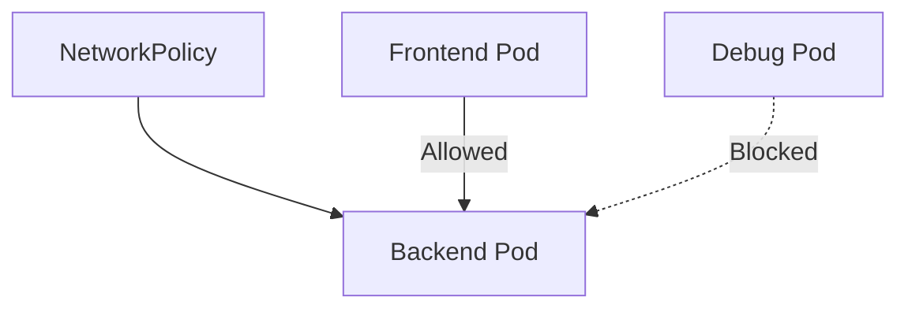

# Lab 10 - NetworkPolicy

## Difficulty

⭐⭐⭐⭐ Advanced

## Estimated Time

35–45 minutes

---

# CKA Objectives Covered

* Create NetworkPolicies
* Understand ingress and egress rules
* Restrict Pod-to-Pod communication
* Verify allowed and denied traffic
* Troubleshoot NetworkPolicy issues

---

# Objective

In this lab, you will:

* Deploy frontend and backend applications.
* Verify unrestricted communication.
* Create a NetworkPolicy.
* Allow only frontend Pods to access backend Pods.
* Verify that unauthorized Pods are blocked.

---

# Prerequisites

> **Important:** NetworkPolicies require a CNI plugin that supports them.

Examples:

* Calico ✅
* Cilium ✅
* Antrea ✅

Some local clusters may not enforce NetworkPolicies unless an appropriate CNI is installed.

---

# Architecture



---

# What is a NetworkPolicy?

A NetworkPolicy controls how Pods communicate with each other.

It can define:

* Ingress rules
* Egress rules
* Allowed namespaces
* Allowed Pods
* Allowed IP ranges

Without a NetworkPolicy:

* All Pods can communicate.

With a NetworkPolicy:

* Only explicitly allowed traffic is permitted.

---

# Step 1 - Create the Backend Deployment

```bash
kubectl create deployment backend \
  --image=nginx
```

Expose it:

```bash
kubectl expose deployment backend \
  --name=backend-service \
  --port=80
```

---

# Step 2 - Create a Frontend Pod

```bash
kubectl run frontend \
  --image=busybox:1.36 \
  --restart=Never \
  -- sleep 3600
```

---

# Step 3 - Create a Debug Pod

```bash
kubectl run debug \
  --image=busybox:1.36 \
  --restart=Never \
  -- sleep 3600
```

---

# Step 4 - Label the Frontend Pod

```bash
kubectl label pod frontend role=frontend
```

Verify:

```bash
kubectl get pods --show-labels
```

---

# Step 5 - Verify Communication Before NetworkPolicy

Connect to the frontend Pod:

```bash
kubectl exec -it frontend -- sh
```

Run:

```sh
wget -qO- http://backend-service
```

Expected:

NGINX welcome page.

Exit the Pod.

Now test from the debug Pod:

```bash
kubectl exec -it debug -- sh
```

Run:

```sh
wget -qO- http://backend-service
```

Expected:

This also succeeds because no NetworkPolicy exists.

---

# Step 6 - Create the NetworkPolicy

Create:

```text
networkpolicy.yaml
```

```yaml
apiVersion: networking.k8s.io/v1
kind: NetworkPolicy

metadata:
  name: backend-policy

spec:

  podSelector:

    matchLabels:

      app: backend

  policyTypes:

  - Ingress

  ingress:

  - from:

    - podSelector:

        matchLabels:

          role: frontend
```

Apply:

```bash
kubectl apply -f networkpolicy.yaml
```

---

# Step 7 - Verify Allowed Traffic

From the frontend Pod:

```bash
kubectl exec -it frontend -- sh
```

Run:

```sh
wget -qO- http://backend-service
```

Expected:

Request succeeds.

---

# Step 8 - Verify Blocked Traffic

From the debug Pod:

```bash
kubectl exec -it debug -- sh
```

Run:

```sh
wget -qO- http://backend-service
```

Expected:

Connection fails because the debug Pod does not match the allowed selector.

---

# Step 9 - Inspect the NetworkPolicy

```bash
kubectl get networkpolicy
```

Describe:

```bash
kubectl describe networkpolicy backend-policy
```

Review:

* Pod selector
* Ingress rules
* Allowed Pods

---

# Verification Checklist

✅ Backend Deployment created.

✅ Service created.

✅ Frontend Pod created.

✅ Debug Pod created.

✅ NetworkPolicy applied.

✅ Frontend access allowed.

✅ Debug access denied.

---

# Common Errors

## NetworkPolicy Has No Effect

Verify:

```bash
kubectl get pods -o wide
```

Check your CNI plugin supports NetworkPolicies.

Examples:

* Calico
* Cilium
* Antrea

---

## Frontend Cannot Access Backend

Verify labels:

```bash
kubectl get pods --show-labels
```

Confirm:

```text
role=frontend
```

Verify the NetworkPolicy selector matches the Pod labels.

---

## Debug Pod Still Has Access

Possible causes:

* CNI does not enforce NetworkPolicies.
* Incorrect Pod labels.
* Policy not applied.
* Wrong namespace.

---

# Production Discussion

NetworkPolicies are commonly used to:

* Protect databases.
* Isolate microservices.
* Restrict namespace communication.
* Implement Zero Trust networking.

Production environments should avoid allowing unrestricted Pod communication.

---

# Real World Notes

* NetworkPolicies are deny-by-policy, not deny-by-default.
* Pods without matching policies continue using the default allow behavior.
* Both ingress and egress rules can be configured.
* Always test NetworkPolicies after deployment.

---

# Traffic Flow

Before Policy

```text
Frontend

↓

Backend

Debug

↓

Backend
```

After Policy

```text
Frontend

↓

Backend

Debug

✖

Backend
```

---

# Knowledge Check

1. What does a NetworkPolicy control?
2. Do NetworkPolicies work without a compatible CNI?
3. What happens when no NetworkPolicy exists?
4. Can a NetworkPolicy control ingress, egress, or both?
5. Why is label selection important for NetworkPolicies?

---

# Cleanup

```bash
kubectl delete networkpolicy backend-policy

kubectl delete svc backend-service

kubectl delete deployment backend

kubectl delete pod frontend

kubectl delete pod debug
```

---

# Challenge

1. Create two backend applications.
2. Allow frontend Pods to access only one backend.
3. Create an egress policy that allows DNS traffic but blocks internet access.
4. Verify the policy using BusyBox Pods.
5. Explain how NetworkPolicies support Zero Trust networking.
