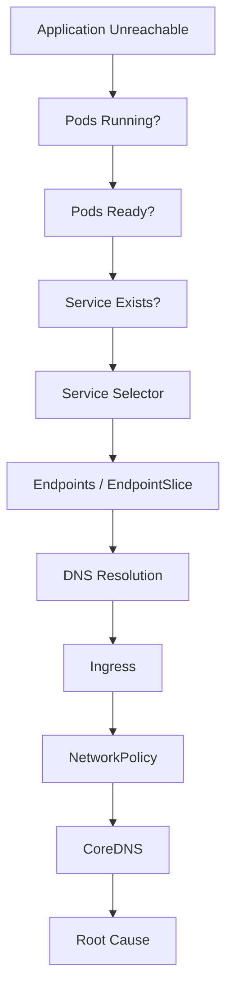

# Lab 11 - Networking Troubleshooting

## Difficulty

⭐⭐⭐⭐⭐ Expert

## Estimated Time

45–60 minutes

---

# CKA Objectives Covered

* Troubleshoot Service connectivity
* Verify Endpoints and EndpointSlices
* Debug DNS resolution
* Verify Ingress configuration
* Troubleshoot NetworkPolicies
* Apply a systematic networking troubleshooting workflow

---

# Objective

In this lab, you will troubleshoot common Kubernetes networking problems using a structured approach.

By the end of this lab, you should be able to identify the root cause of most Service-related failures.

---

# Production Troubleshooting Workflow



---

# Lab Environment

Deploy an application.

```bash
kubectl create deployment nginx \
  --image=nginx \
  --replicas=2

kubectl expose deployment nginx \
  --name=nginx-service \
  --port=80
```

Verify:

```bash
kubectl get pods

kubectl get svc
```

---

# Scenario 1 - Service Has No Endpoints

## Symptoms

```text
kubectl get endpoints nginx-service

ENDPOINTS

<none>
```

---

## Investigation

```bash
kubectl describe svc nginx-service

kubectl get pods --show-labels

kubectl get endpoints
```

---

## Root Cause

Service selector does not match Pod labels.

---

## Resolution

Correct the selector or Pod labels.

Verify:

```bash
kubectl get endpoints
```

---

# Scenario 2 - Pods Running but Traffic Fails

## Symptoms

Pods are Running.

Application is unreachable.

---

## Investigation

```bash
kubectl get pods

kubectl describe pod <pod-name>
```

Check:

```text
READY
```

---

## Root Cause

Pods are not Ready.

Services only send traffic to Ready Pods.

---

## Resolution

Fix the readiness probe or application startup issue.

---

# Scenario 3 - DNS Resolution Failure

## Symptoms

```bash
nslookup nginx-service
```

fails.

---

## Investigation

```bash
kubectl get pods -n kube-system

kubectl logs -n kube-system deployment/coredns

kubectl exec -it <pod-name> -- sh

cat /etc/resolv.conf
```

---

## Root Cause

Possible causes:

* CoreDNS unavailable
* Incorrect namespace
* Missing Service

---

## Resolution

Restore CoreDNS or correct the DNS configuration.

---

# Scenario 4 - Ingress Returns HTTP 404

## Investigation

```bash
kubectl get ingress

kubectl describe ingress

kubectl get svc

kubectl get endpoints
```

---

## Root Cause

Possible causes:

* Wrong host
* Wrong path
* Backend Service missing
* Empty Endpoints

---

## Resolution

Correct the Ingress rule or backend Service.

---

# Scenario 5 - NetworkPolicy Blocking Traffic

## Symptoms

Pods are healthy.

DNS works.

Traffic still fails.

---

## Investigation

```bash
kubectl get networkpolicy

kubectl describe networkpolicy
```

---

## Root Cause

Traffic denied by NetworkPolicy.

---

## Resolution

Update ingress or egress rules to allow the required communication.

---

# Scenario 6 - LoadBalancer EXTERNAL-IP Pending

## Investigation

```bash
kubectl get svc
```

---

## Root Cause

Cluster does not provide a cloud LoadBalancer implementation.

---

## Resolution

* Install MetalLB for local clusters.
* Use a managed cloud provider.
* Use NodePort for testing.

---

# Scenario 7 - NodePort Not Reachable

## Investigation

```bash
kubectl get svc

kubectl get nodes -o wide

kubectl describe svc
```

---

## Possible Causes

* Wrong NodePort
* Firewall
* Node not reachable
* Backend Pods unavailable

---

## Resolution

Verify Node IP, NodePort, firewall, and Service configuration.

---

# Scenario 8 - EndpointSlice Verification

```bash
kubectl get endpoints

kubectl get endpointslice
```

Compare both resources.

Observe how EndpointSlices provide scalable backend discovery.

---

# Scenario 9 - Complete Connectivity Test

Create a temporary BusyBox Pod.

```bash
kubectl run debug \
  --image=busybox:1.36 \
  --restart=Never \
  -it --rm -- sh
```

Inside the Pod:

```sh
nslookup nginx-service

wget -qO- http://nginx-service
```

If either command fails, return to the troubleshooting workflow.

---

# Verification Checklist

✅ Pods Running

✅ Pods Ready

✅ Service Exists

✅ Selector Verified

✅ Endpoints Verified

✅ EndpointSlice Verified

✅ DNS Working

✅ CoreDNS Healthy

✅ Ingress Verified

✅ NetworkPolicy Verified

---

# Common Troubleshooting Commands

```bash
kubectl get pods -o wide

kubectl get svc

kubectl get endpoints

kubectl get endpointslice

kubectl get ingress

kubectl get networkpolicy

kubectl describe svc nginx-service

kubectl describe ingress

kubectl logs -n kube-system deployment/coredns

kubectl exec -it <pod-name> -- sh

nslookup nginx-service

wget -qO- http://nginx-service
```

---

# Production Troubleshooting Checklist

Always verify in this order:

1. Pods
2. Readiness
3. Service
4. Selector
5. Endpoints
6. EndpointSlices
7. DNS
8. CoreDNS
9. Ingress
10. NetworkPolicies

Never skip directly to editing YAML files.

---

# Real World Notes

* Empty Endpoints are one of the most common Service failures.
* DNS failures are often caused by missing Services rather than CoreDNS.
* An Ingress resource without an Ingress Controller does nothing.
* Most production networking issues are resolved by following a consistent troubleshooting process instead of guessing.

---

# Knowledge Check

1. What should you check first when an application is unreachable?
2. Why might a Service have no Endpoints?
3. How do you verify DNS resolution inside a Pod?
4. Why might a LoadBalancer Service remain in the Pending state?
5. Which resource actually enforces NetworkPolicies?
6. Why is Pod **Ready** more important than Pod **Running**?

---

# Cleanup

```bash
kubectl delete svc nginx-service

kubectl delete deployment nginx

kubectl delete ingress --all

kubectl delete networkpolicy --all
```

---

# Final Challenge

A production application is unavailable.

Users report:

* Browser returns HTTP 404.
* DNS resolution succeeds.
* Pods are Running.
* Service exists.

Your task:

1. Identify the root cause.
2. Explain the troubleshooting workflow.
3. List the commands you would run.
4. Apply the fix.
5. Verify the application is healthy again.

---

# Chapter Summary

Congratulations! 🎉

You have completed the **Services & Networking** chapter.

You now understand:

* ClusterIP
* NodePort
* LoadBalancer
* ExternalName
* Endpoints
* EndpointSlice
* DNS
* CoreDNS
* Ingress
* NetworkPolicy
* Production networking troubleshooting

These concepts form the foundation of Kubernetes networking and are essential for the CKA exam and real-world production environments.
