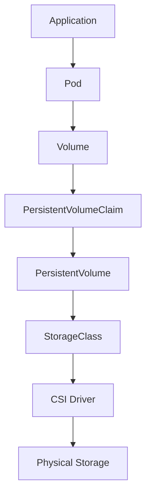

# CKA - Storage

> **Goal:** Learn how Kubernetes manages data using Volumes, PersistentVolumes, PersistentVolumeClaims, StorageClasses, and CSI to support stateful applications.

---

# 📚 Chapter Contents

* Learning Objectives
* Why Storage Matters
* Kubernetes Storage Fundamentals
* Storage Architecture
* Volumes
* emptyDir
* hostPath
* PersistentVolume (PV)
* PersistentVolumeClaim (PVC)
* StorageClass
* Dynamic Provisioning
* CSI (Container Storage Interface)
* Stateful Applications
* Production Decision Tree
* Best Practices
* Summary
* References

---

# Learning Objectives

After completing this chapter, you should be able to:

* Explain why container filesystems are ephemeral.
* Differentiate between Volumes, PVs, and PVCs.
* Configure persistent storage for applications.
* Understand StorageClasses and dynamic provisioning.
* Explain the role of CSI drivers.
* Troubleshoot common storage issues.
* Answer CKA and Senior DevOps interview questions confidently.

---

# Why Storage Matters

Containers are **ephemeral**.

If a container writes data to its local filesystem and the Pod is:

* Deleted
* Rescheduled
* Recreated

that data is lost.

For applications like:

* Databases
* Message queues
* File servers
* Content management systems

persistent storage is essential.

---

# Kubernetes Storage Fundamentals

Kubernetes separates:

* Compute
* Networking
* Storage

Storage is attached to Pods through **Volumes**.

Persistent storage is managed independently of Pod lifecycle.

---

# Storage Journey

```text id="k4jv8q"
Container Filesystem
        │
        ▼
Volumes
        │
        ▼
emptyDir
        │
        ▼
hostPath
        │
        ▼
PersistentVolume
        │
        ▼
PersistentVolumeClaim
        │
        ▼
StorageClass
        │
        ▼
Dynamic Provisioning
        │
        ▼
CSI Driver
        │
        ▼
Stateful Applications
```

---

# Storage Architecture



---

# Volumes

A Volume provides storage that is mounted into one or more containers in a Pod.

Unlike the container filesystem, a Volume survives container restarts within the same Pod.

Common Volume types:

* emptyDir
* hostPath
* ConfigMap
* Secret
* PersistentVolume-backed storage

---

# emptyDir

An **emptyDir** Volume is created when a Pod starts.

Characteristics:

* Shared between containers in the same Pod.
* Deleted when the Pod is removed.
* Suitable for temporary data.

Typical use cases:

* Scratch space
* Caching
* Temporary processing

---

# hostPath

A **hostPath** Volume mounts a directory from the Kubernetes node into the Pod.

Characteristics:

* Uses node local storage.
* Tightly couples the Pod to a specific node.
* Common in development and testing.

Typical use cases:

* Local development
* Single-node clusters
* Log collection

---

# PersistentVolume (PV)

A PersistentVolume is a cluster resource that represents available storage.

Characteristics:

* Independent of Pods.
* Can outlive application lifecycle.
* Managed by administrators or dynamically provisioned.

---

# PersistentVolumeClaim (PVC)

A PersistentVolumeClaim is a request for storage made by a user or application.

The PVC requests:

* Capacity
* Access mode
* StorageClass

Kubernetes binds the PVC to a matching PersistentVolume.

---

# StorageClass

A StorageClass defines how new PersistentVolumes are provisioned.

It specifies:

* Provisioner
* Reclaim policy
* Volume binding mode
* Storage parameters

Most modern Kubernetes clusters use StorageClasses with dynamic provisioning.

---

# Dynamic Provisioning

Without dynamic provisioning:

Administrator creates PV → User creates PVC

With dynamic provisioning:

User creates PVC → Kubernetes automatically provisions the PV

Benefits:

* Automation
* Faster deployments
* Better scalability

---

# CSI (Container Storage Interface)

CSI provides a standard interface between Kubernetes and storage providers.

Examples:

* Amazon EBS CSI
* Azure Disk CSI
* Google Persistent Disk CSI
* NFS CSI
* Ceph CSI

Benefits:

* Vendor-independent
* Extensible
* Standardized storage integration

---

# Stateful Applications

Examples:

* PostgreSQL
* MySQL
* MongoDB
* Redis
* Elasticsearch

Stateful applications require persistent storage to retain data across Pod restarts and rescheduling.

---

# Production Decision Tree

```text id="y8m3cx"
Need temporary storage?
        │
        ▼
emptyDir

Need node-local storage?
        │
        ▼
hostPath

Need persistent storage?
        │
        ▼
PersistentVolume + PersistentVolumeClaim

Need automatic provisioning?
        │
        ▼
StorageClass

Need cloud or external storage?
        │
        ▼
CSI Driver
```

---

# Best Practices

* Use emptyDir only for temporary data.
* Avoid hostPath in production unless absolutely necessary.
* Use PVCs instead of referencing PVs directly.
* Prefer StorageClasses with dynamic provisioning.
* Use CSI drivers supported by your storage platform.
* Choose appropriate access modes for your workload.
* Monitor storage capacity and usage.

---

# Summary

In this chapter you learned:

* Why container storage is ephemeral.
* How Volumes work.
* The difference between PV and PVC.
* How StorageClasses automate provisioning.
* The role of CSI drivers.
* How Kubernetes supports stateful workloads.

---

# References

* Kubernetes Volumes Documentation
* Persistent Volumes Documentation
* StorageClasses Documentation
* CSI Documentation
* Stateful Applications Documentation
* CKA Curriculum
