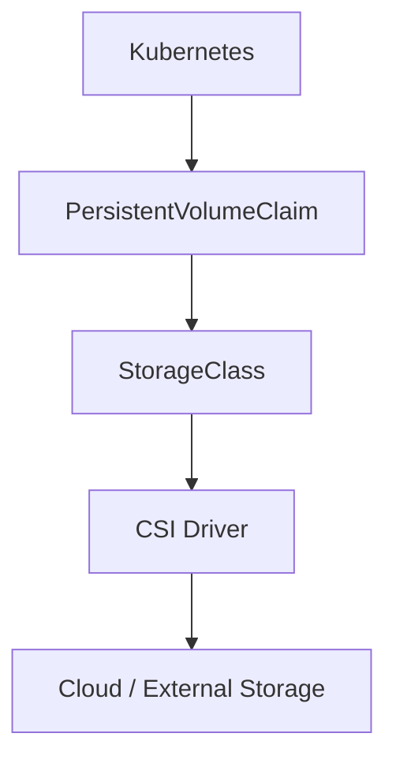

# CSI Driver

```mermaid
flowchart TD
    Kubernetes[Kubernetes]
    PVC[PersistentVolumeClaim]
    SC[StorageClass]
    CSI[CSI Driver]
    CloudStorage[Cloud / External Storage]

    Kubernetes --> PVC
    PVC --> SC
    SC --> CSI
    CSI --> CloudStorage
```

## Key Point

CSI provides a standard interface between Kubernetes and external storage providers.
