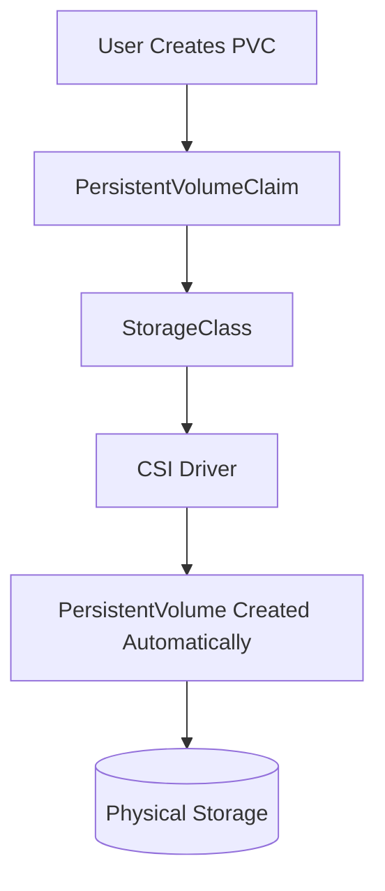

# Dynamic Provisioning

```mermaid
flowchart TD
    User[User Creates PVC]
    PVC[PersistentVolumeClaim]
    SC[StorageClass]
    CSI[CSI Driver]
    PV[PersistentVolume Created Automatically]
    Storage[(Physical Storage)]

    User --> PVC
    PVC --> SC
    SC --> CSI
    CSI --> PV
    PV --> Storage
```

## Key Point

Dynamic provisioning automatically creates a PersistentVolume when a PVC requests storage through a StorageClass.
