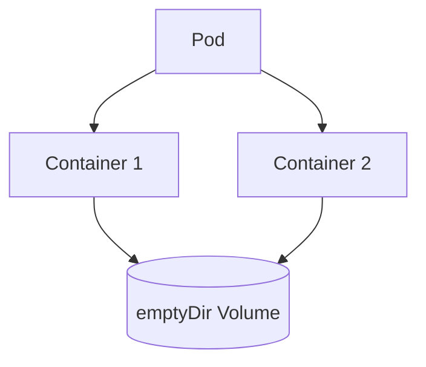

# emptyDir

```mermaid
flowchart TD
    Pod[Pod]
    Container1[Container 1]
    Container2[Container 2]
    EmptyDir[(emptyDir Volume)]

    Pod --> Container1
    Pod --> Container2
    Container1 --> EmptyDir
    Container2 --> EmptyDir
```

## Key Point

`emptyDir` is temporary storage created with the Pod and deleted when the Pod is removed.
