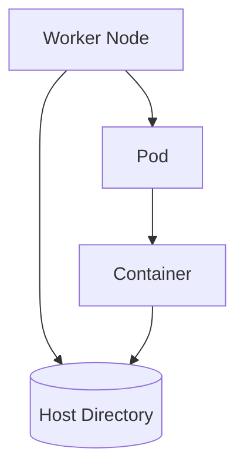

# hostPath

```mermaid
flowchart TD
    Node[Worker Node]
    HostDir[(Host Directory)]
    Pod[Pod]
    Container[Container]

    Node --> HostDir
    Node --> Pod
    Pod --> Container
    Container --> HostDir
```

## Key Point

`hostPath` mounts a directory from the node into the Pod and should be avoided in most production workloads.
