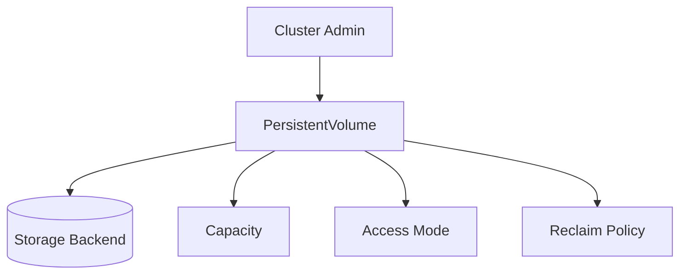

# PersistentVolume

```mermaid
flowchart TD
    Admin[Cluster Admin]
    PV[PersistentVolume]
    Storage[(Storage Backend)]
    Capacity[Capacity]
    AccessMode[Access Mode]
    ReclaimPolicy[Reclaim Policy]

    Admin --> PV
    PV --> Storage
    PV --> Capacity
    PV --> AccessMode
    PV --> ReclaimPolicy
```

## Key Point

A PersistentVolume is a cluster-level storage resource that exists independently of Pods.
