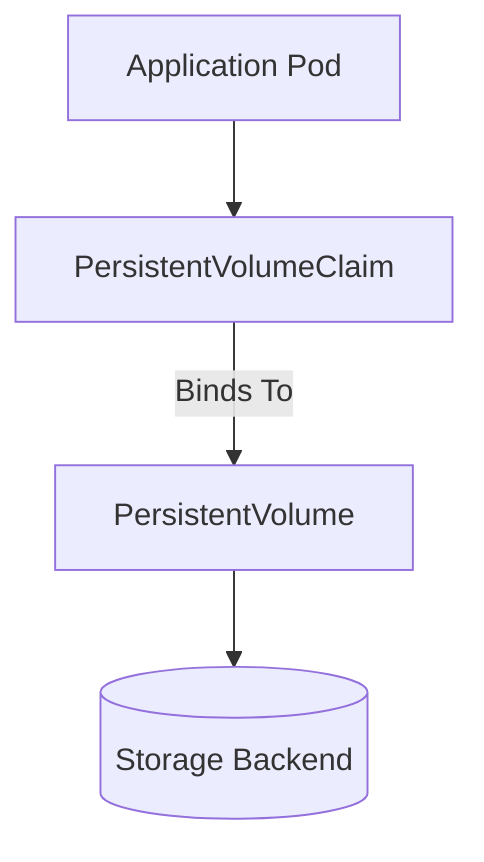

# PersistentVolumeClaim

```mermaid
flowchart TD
    App[Application Pod]
    PVC[PersistentVolumeClaim]
    PV[PersistentVolume]
    Storage[(Storage Backend)]

    App --> PVC
    PVC -->|Binds To| PV
    PV --> Storage
```

## Key Point

A PVC is an application's request for storage. Kubernetes binds it to a matching PV.
