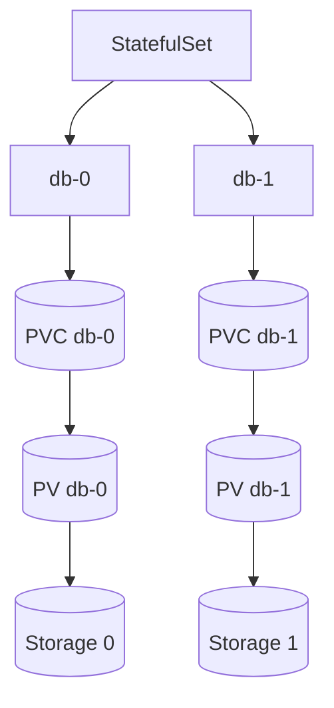

# Stateful Application Storage

```mermaid
flowchart TD
    StatefulSet[StatefulSet]
    Pod0[db-0]
    Pod1[db-1]
    PVC0[(PVC db-0)]
    PVC1[(PVC db-1)]
    PV0[(PV db-0)]
    PV1[(PV db-1)]
    Storage0[(Storage 0)]
    Storage1[(Storage 1)]

    StatefulSet --> Pod0
    StatefulSet --> Pod1

    Pod0 --> PVC0
    Pod1 --> PVC1

    PVC0 --> PV0
    PVC1 --> PV1

    PV0 --> Storage0
    PV1 --> Storage1
```

## Key Point

Stateful applications use stable identities and persistent storage so data survives Pod recreation.
