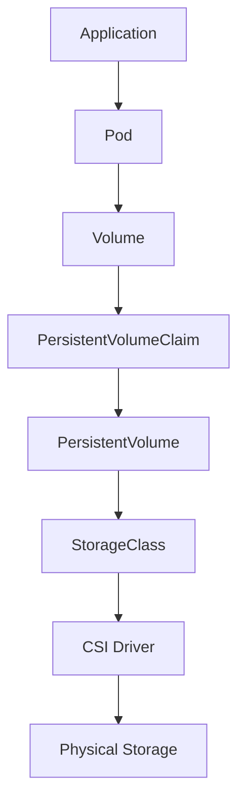

# Storage Overview

```mermaid
flowchart TD
    App[Application]
    Pod[Pod]
    Volume[Volume]
    PVC[PersistentVolumeClaim]
    PV[PersistentVolume]
    SC[StorageClass]
    CSI[CSI Driver]
    Storage[Physical Storage]

    App --> Pod
    Pod --> Volume
    Volume --> PVC
    PVC --> PV
    PV --> SC
    SC --> CSI
    CSI --> Storage
```

## Key Point

Kubernetes storage connects applications to persistent storage through Volumes, PVCs, PVs, StorageClasses, and CSI drivers.
