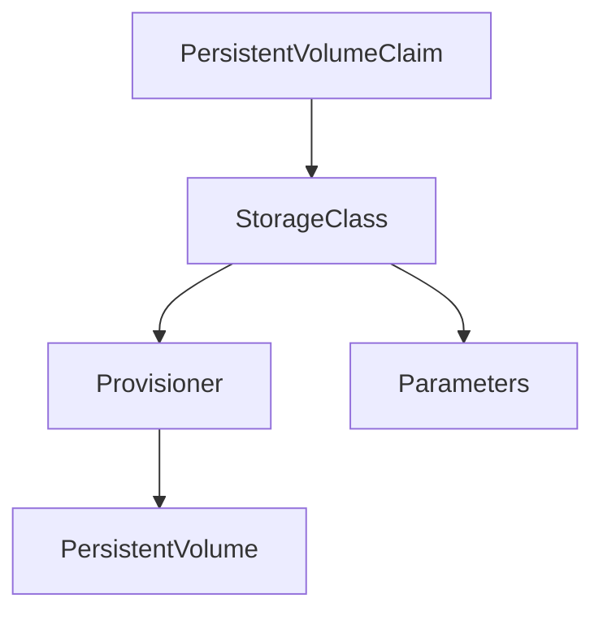

# StorageClass

```mermaid
flowchart TD
    PVC[PersistentVolumeClaim]
    SC[StorageClass]
    Provisioner[Provisioner]
    Parameters[Parameters]
    PV[PersistentVolume]

    PVC --> SC
    SC --> Provisioner
    SC --> Parameters
    Provisioner --> PV
```

## Key Point

A StorageClass defines how storage should be provisioned dynamically.
