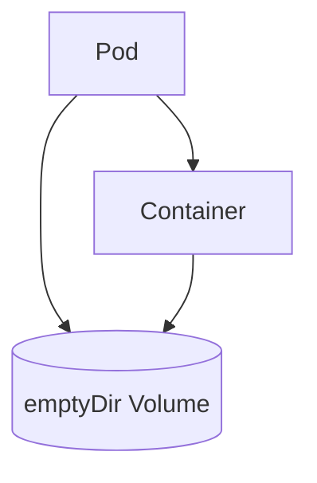

# Lab 01 - emptyDir Volume

## Difficulty

⭐ Beginner

## Estimated Time

15–20 minutes

---

# CKA Objectives Covered

* Create an `emptyDir` volume
* Mount a volume into a container
* Verify data persistence across container restarts
* Understand the lifecycle of `emptyDir`

---

# Objective

In this lab, you will:

* Create a Pod with an `emptyDir` volume.
* Write data to the volume.
* Verify the data is shared through the mounted volume.
* Observe what happens when the Pod is deleted.

---

# Architecture



---

# What is emptyDir?

An `emptyDir` volume:

* Is created when a Pod starts.
* Is shared by all containers in the Pod.
* Survives container restarts.
* Is deleted when the Pod is deleted.

---

# Step 1 - Create the Pod

Create a file named:

```text
emptydir-pod.yaml
```

```yaml
apiVersion: v1
kind: Pod

metadata:
  name: emptydir-demo

spec:
  containers:
  - name: app
    image: busybox:1.36
    command:
    - sh
    - -c
    - sleep 3600

    volumeMounts:
    - name: cache-volume
      mountPath: /cache

  volumes:
  - name: cache-volume
    emptyDir: {}
```

Apply it:

```bash
kubectl apply -f emptydir-pod.yaml
```

---

# Step 2 - Verify the Pod

```bash
kubectl get pod emptydir-demo

kubectl describe pod emptydir-demo
```

Verify that the volume is mounted at `/cache`.

---

# Step 3 - Write Data

Connect to the Pod:

```bash
kubectl exec -it emptydir-demo -- sh
```

Inside the container:

```sh
echo "Hello Kubernetes Storage" > /cache/message.txt

cat /cache/message.txt
```

Expected:

```text
Hello Kubernetes Storage
```

Exit the shell.

---

# Step 4 - Verify the File

Reconnect:

```bash
kubectl exec -it emptydir-demo -- sh
```

Run:

```sh
ls -l /cache

cat /cache/message.txt
```

The file should still exist because the Pod is still running.

---

# Step 5 - Delete the Pod

Delete the Pod:

```bash
kubectl delete pod emptydir-demo
```

---

# Step 6 - Recreate the Pod

```bash
kubectl apply -f emptydir-pod.yaml
```

Wait until it is running:

```bash
kubectl get pod emptydir-demo
```

Connect again:

```bash
kubectl exec -it emptydir-demo -- sh
```

Check the directory:

```sh
ls -l /cache
```

Expected:

The directory is empty.

The file created earlier is gone because the Pod was deleted.

---

# Verification Checklist

✅ Pod created.

✅ emptyDir volume mounted.

✅ File written successfully.

✅ File persisted while the Pod existed.

✅ File disappeared after Pod recreation.

---

# Common Errors

## Mount Path Not Found

Verify:

```bash
kubectl describe pod emptydir-demo
```

---

## Pod Not Starting

Verify:

```bash
kubectl get events --sort-by=.lastTimestamp
```

---

## File Missing

Remember:

`emptyDir` survives **container restarts**, but **not Pod deletion**.

---

# Production Discussion

Use `emptyDir` for:

* Temporary files
* Application cache
* Shared data between containers
* Intermediate processing

Do **not** use `emptyDir` for:

* Databases
* User uploads
* Application state
* Persistent business data

---

# Real World Notes

Examples of good `emptyDir` usage:

* Log processing
* Scratch space
* Temporary downloads
* Build artifacts
* Shared cache between sidecars

---

# Knowledge Check

1. When is an `emptyDir` volume created?
2. When is it deleted?
3. Does it survive a container restart?
4. Does it survive Pod deletion?
5. When should you use `emptyDir`?

---

# Cleanup

```bash
kubectl delete pod emptydir-demo
```

---

# Challenge

1. Create a Pod with two containers.
2. Mount the same `emptyDir` volume into both containers.
3. Write a file from the first container.
4. Read the same file from the second container.
5. Delete the Pod and verify the file is removed.
