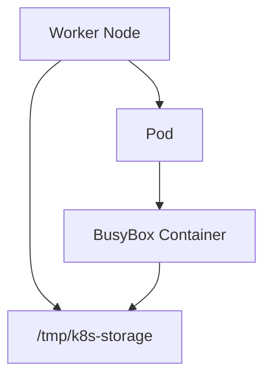

# Lab 02 - hostPath Volume

## Difficulty

⭐⭐ Beginner

## Estimated Time

20–30 minutes

---

# CKA Objectives Covered

* Create a `hostPath` volume
* Mount a host directory into a Pod
* Verify data persistence on the node
* Understand node-local storage
* Compare `hostPath` with `emptyDir`

---

# Objective

In this lab, you will:

* Create a Pod using a `hostPath` volume.
* Write data to the mounted directory.
* Verify the data persists after Pod recreation.
* Understand the limitations of node-local storage.

---

# Architecture



---

# What is hostPath?

A `hostPath` volume mounts a directory from the Kubernetes node into a Pod.

Characteristics:

* Uses the node's local filesystem.
* Persists after the Pod is deleted.
* Ties the workload to a specific node.
* Mostly used for development, testing, and special infrastructure workloads.

---

# Step 1 - Create the Pod

Create a file:

```text
hostpath-pod.yaml
```

```yaml
apiVersion: v1
kind: Pod

metadata:
  name: hostpath-demo

spec:
  containers:
  - name: app
    image: busybox:1.36
    command:
    - sh
    - -c
    - sleep 3600

    volumeMounts:
    - name: host-storage
      mountPath: /data

  volumes:
  - name: host-storage
    hostPath:
      path: /tmp/k8s-storage
      type: DirectoryOrCreate
```

Apply:

```bash
kubectl apply -f hostpath-pod.yaml
```

---

# Step 2 - Verify the Pod

```bash
kubectl get pod hostpath-demo

kubectl describe pod hostpath-demo
```

Verify:

* Volume mounted
* Mount path `/data`

---

# Step 3 - Write Data

Connect:

```bash
kubectl exec -it hostpath-demo -- sh
```

Inside:

```sh
echo "Persistent Node Storage" > /data/storage.txt

cat /data/storage.txt
```

Expected:

```text
Persistent Node Storage
```

Exit.

---

# Step 4 - Verify the File

Reconnect:

```bash
kubectl exec -it hostpath-demo -- sh
```

Run:

```sh
ls -l /data

cat /data/storage.txt
```

The file should still exist.

---

# Step 5 - Delete the Pod

```bash
kubectl delete pod hostpath-demo
```

Notice:

The Pod is deleted, but the directory still exists on the node.

---

# Step 6 - Recreate the Pod

```bash
kubectl apply -f hostpath-pod.yaml
```

Wait:

```bash
kubectl get pod hostpath-demo
```

Reconnect:

```bash
kubectl exec -it hostpath-demo -- sh
```

Verify:

```sh
cat /data/storage.txt
```

Expected:

```text
Persistent Node Storage
```

Unlike `emptyDir`, the file is still available because it is stored on the node.

---

# Step 7 - Compare with emptyDir

| Feature                       | emptyDir | hostPath  |
| ----------------------------- | -------- | --------- |
| Lives on Node                 | ❌        | ✅         |
| Deleted with Pod              | ✅        | ❌         |
| Persists After Pod Recreation | ❌        | ✅         |
| Recommended for Production    | ❌        | Usually ❌ |

---

# Verification Checklist

✅ Pod created.

✅ hostPath mounted.

✅ File written successfully.

✅ Pod deleted.

✅ Pod recreated.

✅ File still exists.

---

# Common Errors

## Volume Not Mounted

Verify:

```bash
kubectl describe pod hostpath-demo
```

---

## Permission Denied

Check:

* Directory permissions
* Container user
* Node filesystem permissions

---

## Data Missing

Possible causes:

* Pod scheduled to a different node.
* Host directory removed manually.
* Incorrect host path configured.

---

# Production Discussion

Typical `hostPath` use cases:

* Local development
* Single-node clusters
* Log collection agents
* Node monitoring
* Device plugins

Avoid using `hostPath` for:

* Databases
* Stateful applications
* Highly available workloads

---

# Real World Notes

Since `hostPath` depends on the node's filesystem:

* If the node fails, the data may become unavailable.
* If the Pod is scheduled to another node, it will not automatically find the same data.
* Production workloads typically use PersistentVolumes backed by network or cloud storage.

---

# Knowledge Check

1. What is a `hostPath` volume?
2. Where is the data stored?
3. Does the data survive Pod deletion?
4. Why is `hostPath` generally discouraged for production applications?
5. What does `DirectoryOrCreate` do?

---

# Cleanup

```bash
kubectl delete pod hostpath-demo
```

---

# Challenge

1. Create a `hostPath` volume using a different directory.
2. Write multiple files into the mounted directory.
3. Delete and recreate the Pod.
4. Verify the files are still present.
5. Explain why this behavior differs from `emptyDir`.
