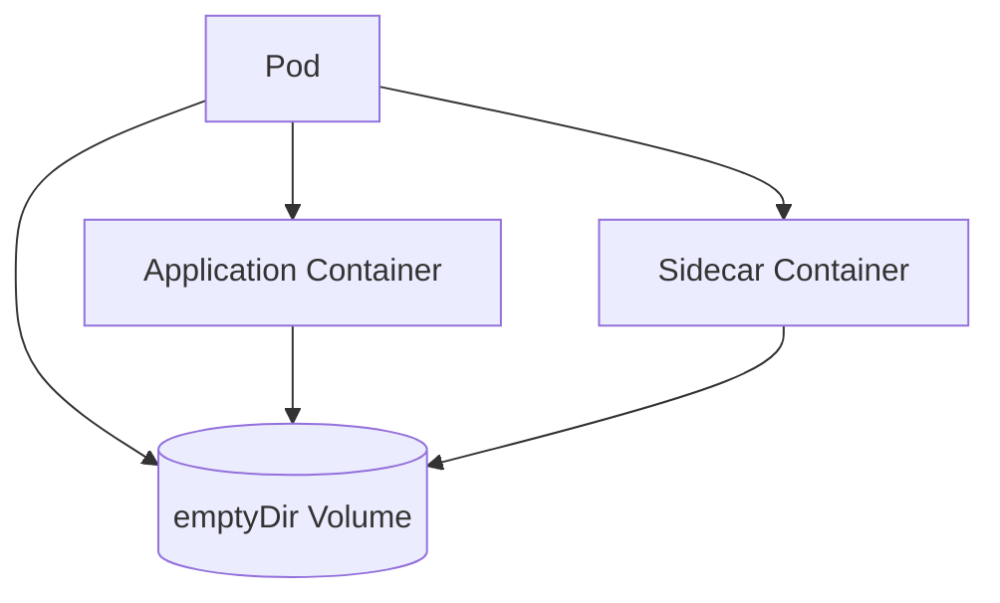

# Lab 03 - Volumes

## Difficulty

⭐⭐ Beginner

## Estimated Time

25–35 minutes

---

# CKA Objectives Covered

* Create a shared Volume
* Mount the same Volume into multiple containers
* Verify data sharing between containers
* Understand Pod-level storage

---

# Objective

In this lab, you will:

* Create a Pod with two containers.
* Mount the same Volume into both containers.
* Write data from one container.
* Read the same data from the second container.
* Understand how Volumes are shared inside a Pod.

---

# Architecture



---

# What is a Volume?

A Volume is storage attached to a Pod.

Unlike the container filesystem:

* It can be shared between containers.
* It survives container restarts.
* Its lifecycle depends on the volume type.

---

# Step 1 - Create the Pod

Create:

```text
shared-volume-pod.yaml
```

```yaml
apiVersion: v1
kind: Pod

metadata:
  name: shared-volume-demo

spec:
  containers:

  - name: app
    image: busybox:1.36
    command:
    - sh
    - -c
    - sleep 3600

    volumeMounts:
    - name: shared-storage
      mountPath: /shared

  - name: sidecar
    image: busybox:1.36
    command:
    - sh
    - -c
    - sleep 3600

    volumeMounts:
    - name: shared-storage
      mountPath: /shared

  volumes:
  - name: shared-storage
    emptyDir: {}
```

Apply:

```bash
kubectl apply -f shared-volume-pod.yaml
```

---

# Step 2 - Verify the Pod

```bash
kubectl get pod shared-volume-demo

kubectl describe pod shared-volume-demo
```

Notice:

* Two containers
* One shared Volume

---

# Step 3 - Write Data from the Application Container

Connect:

```bash
kubectl exec -it shared-volume-demo \
  -c app -- sh
```

Create a file:

```sh
echo "Shared Kubernetes Volume" > /shared/message.txt

cat /shared/message.txt
```

Expected:

```text
Shared Kubernetes Volume
```

Exit.

---

# Step 4 - Read the File from the Sidecar

Connect:

```bash
kubectl exec -it shared-volume-demo \
  -c sidecar -- sh
```

Verify:

```sh
ls -l /shared

cat /shared/message.txt
```

Expected:

```text
Shared Kubernetes Volume
```

Both containers access the same Volume.

---

# Step 5 - Create Another File

Still inside the sidecar:

```sh
echo "Created by Sidecar" > /shared/sidecar.txt
```

Exit.

Reconnect to the application container:

```bash
kubectl exec -it shared-volume-demo \
  -c app -- sh
```

Verify:

```sh
cat /shared/sidecar.txt
```

Expected:

```text
Created by Sidecar
```

---

# Step 6 - Inspect the Pod

```bash
kubectl get pod shared-volume-demo -o yaml
```

Review:

* `volumes`
* `volumeMounts`
* Container definitions

---

# Verification Checklist

✅ Pod created.

✅ Two containers running.

✅ Shared Volume mounted.

✅ First container wrote data.

✅ Second container read the data.

✅ Second container wrote data.

✅ First container read the new data.

---

# Common Errors

## File Not Found

Verify:

```bash
kubectl describe pod shared-volume-demo
```

Ensure both containers mount the same Volume name.

---

## Wrong Mount Path

Check:

```yaml
volumeMounts:
```

Confirm both containers use the correct `mountPath`.

---

## Pod Not Starting

Review:

```bash
kubectl get events --sort-by=.lastTimestamp
```

---

# Production Discussion

Shared Volumes are commonly used with:

* Logging sidecars
* Monitoring agents
* Reverse proxies
* Init containers
* File processing pipelines

Example:

```text
Application

↓

Shared Volume

↓

Fluent Bit Sidecar

↓

Elasticsearch
```

The application writes logs to the shared Volume, while the sidecar ships them to a centralized logging system.

---

# Real World Notes

Volumes are attached to the **Pod**, not individual containers.

Every container that mounts the same Volume sees the same files.

This is the foundation for many sidecar-based architectures.

---

# Volume Types

Common Kubernetes Volume types:

* emptyDir
* hostPath
* ConfigMap
* Secret
* PersistentVolumeClaim
* CSI Volumes

Each has different persistence and lifecycle characteristics.

---

# Knowledge Check

1. What is a Kubernetes Volume?
2. Can multiple containers mount the same Volume?
3. Who owns a Volume—the Pod or the container?
4. Why are shared Volumes useful with sidecars?
5. Does an `emptyDir` Volume survive Pod deletion?

---

# Cleanup

```bash
kubectl delete pod shared-volume-demo
```

---

# Challenge

1. Create a Pod with three containers.
2. Mount the same Volume into all three containers.
3. Write a file from the first container.
4. Read it from the other two containers.
5. Create additional files from each container.
6. Verify that every container sees all files.
7. Explain why this pattern is commonly used with logging sidecars.
