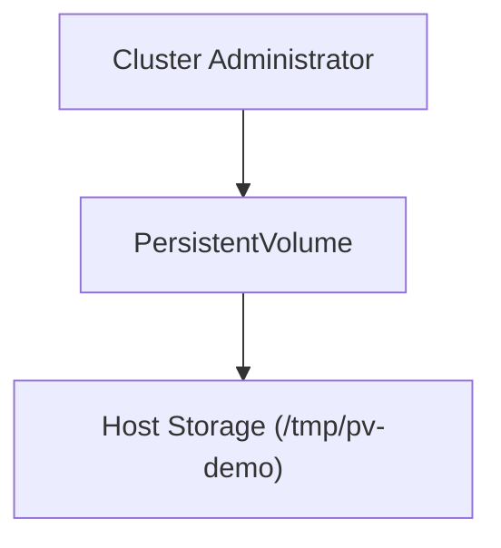

# Lab 04 - PersistentVolume (PV)

## Difficulty

⭐⭐⭐ Intermediate

## Estimated Time

25–35 minutes

---

# CKA Objectives Covered

* Create a PersistentVolume
* Understand PV lifecycle
* Configure capacity and access modes
* Configure reclaim policies
* Inspect PersistentVolume status

---

# Objective

In this lab, you will:

* Create a PersistentVolume.
* Verify its configuration.
* Inspect capacity and access modes.
* Understand reclaim policies.
* Observe the PV lifecycle before it is claimed.

---

# Architecture



---

# What is a PersistentVolume?

A PersistentVolume (PV) is a cluster resource that represents available storage.

Characteristics:

* Independent of Pods.
* Independent of applications.
* Can outlive Pods.
* Can be claimed by a PersistentVolumeClaim (PVC).

Think of a PV as storage that is made available to the cluster.

---

# Step 1 - Create the PersistentVolume

Create a file:

```text id="v1t9ep"
persistentvolume.yaml
```

```yaml id="a6p4kw"
apiVersion: v1
kind: PersistentVolume

metadata:
  name: pv-demo

spec:
  capacity:
    storage: 1Gi

  accessModes:
    - ReadWriteOnce

  persistentVolumeReclaimPolicy: Retain

  hostPath:
    path: /tmp/pv-demo
```

Apply it:

```bash id="m8g2vx"
kubectl apply -f persistentvolume.yaml
```

---

# Step 2 - Verify the PersistentVolume

```bash id="p5k8hf"
kubectl get pv
```

Expected:

```text id="y4x8nr"
NAME      CAPACITY   ACCESS MODES   RECLAIM POLICY   STATUS

pv-demo   1Gi        RWO            Retain           Available
```

Notice:

* Capacity: **1Gi**
* Access Mode: **ReadWriteOnce**
* Status: **Available**

---

# Step 3 - Describe the PersistentVolume

```bash id="f8j6tn"
kubectl describe pv pv-demo
```

Review:

* Capacity
* Access modes
* Reclaim policy
* Volume source
* Status

---

# Step 4 - View the YAML

```bash id="c9r4wb"
kubectl get pv pv-demo -o yaml
```

Observe:

* `capacity`
* `accessModes`
* `hostPath`
* `persistentVolumeReclaimPolicy`

---

# Step 5 - Understand Access Modes

Common access modes:

| Access Mode             | Description                  |
| ----------------------- | ---------------------------- |
| ReadWriteOnce (RWO)     | Read/write by one node       |
| ReadOnlyMany (ROX)      | Read-only by multiple nodes  |
| ReadWriteMany (RWX)     | Read/write by multiple nodes |
| ReadWriteOncePod (RWOP) | Read/write by one Pod        |

Verify the configured access mode:

```bash id="q2m7da"
kubectl describe pv pv-demo
```

---

# Step 6 - Understand Reclaim Policies

Current reclaim policy:

```text id="s4y7ql"
Retain
```

Meaning:

* When the PVC is deleted later, the underlying storage is **not** automatically removed.
* Manual cleanup is required.

Other reclaim policies include:

* Delete
* Retain

---

# Step 7 - Observe the PV Status

Run:

```bash id="k3v9pc"
kubectl get pv
```

Expected:

```text id="j6d5eu"
STATUS

Available
```

The PV remains **Available** because no PVC has claimed it yet.

In the next lab, you'll create a PVC that binds to this PV.

---

# Verification Checklist

✅ PersistentVolume created.

✅ Capacity configured.

✅ Access mode verified.

✅ Reclaim policy verified.

✅ Status is **Available**.

---

# Common Errors

## PV Not Created

Verify:

```bash id="z5w8mx"
kubectl get pv
```

Review:

```bash id="w8k4tf"
kubectl describe pv pv-demo
```

---

## Incorrect Capacity

Check:

```yaml id="e7p2jn"
capacity:
  storage: 1Gi
```

Ensure the storage quantity uses a valid Kubernetes unit.

---

## Invalid Access Mode

Verify:

```yaml id="v2q8ny"
accessModes:
- ReadWriteOnce
```

Use supported access modes only.

---

# Production Discussion

In production, administrators rarely create `hostPath`-backed PVs.

PersistentVolumes are typically backed by:

* Cloud block storage
* Network file systems
* SAN/NAS
* Distributed storage platforms
* CSI drivers

---

# Real World Notes

* A PV is a cluster resource, not a namespaced resource.
* Multiple applications can request storage, but each PVC binds according to access modes and capacity.
* Applications should **never reference a PV directly**. They should always use a PVC.

---

# PV Lifecycle

```text id="m9u4bx"
Create PV

↓

Available

↓

Bound (after PVC)

↓

Released (PVC deleted)

↓

Available or Deleted
```

The final state depends on the reclaim policy.

---

# Knowledge Check

1. What is a PersistentVolume?
2. Is a PV namespaced?
3. What does the **Available** status mean?
4. What is the purpose of a reclaim policy?
5. Should applications use a PV directly?

---

# Cleanup

> **Do not delete the PersistentVolume.**

It will be used in **Lab 05** when creating a PersistentVolumeClaim.

If you need to remove it later:

```bash id="n4h7ry"
kubectl delete pv pv-demo
```

---

# Challenge

1. Create a second PersistentVolume with **2Gi** capacity.
2. Configure a different reclaim policy.
3. Compare the two PVs.
4. Explain the difference between **Available** and **Bound**.
5. Describe when you would choose **Retain** versus **Delete**.
