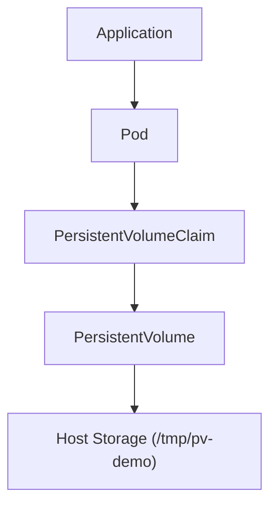

# Lab 05 - PersistentVolumeClaim (PVC)

## Difficulty

⭐⭐⭐ Intermediate

## Estimated Time

30–40 minutes

---

# CKA Objectives Covered

* Create a PersistentVolumeClaim
* Bind a PVC to a PersistentVolume
* Mount a PVC into a Pod
* Verify persistent storage
* Understand the PV-PVC relationship

---

# Objective

In this lab, you will:

* Create a PersistentVolumeClaim.
* Bind it to the PersistentVolume created in Lab 04.
* Mount the claim into a Pod.
* Write data to the volume.
* Verify the data persists after Pod recreation.

---

# Architecture



---

# Prerequisite

This lab uses the PersistentVolume created in **Lab 04**.

Verify:

```bash
kubectl get pv
```

Expected:

```text
NAME      STATUS

pv-demo   Available
```

---

# Step 1 - Create the PersistentVolumeClaim

Create:

```text
persistentvolumeclaim.yaml
```

```yaml
apiVersion: v1
kind: PersistentVolumeClaim

metadata:
  name: pvc-demo

spec:
  accessModes:
    - ReadWriteOnce

  resources:
    requests:
      storage: 1Gi
```

Apply:

```bash
kubectl apply -f persistentvolumeclaim.yaml
```

---

# Step 2 - Verify the Binding

```bash
kubectl get pvc

kubectl get pv
```

Expected:

PVC:

```text
NAME       STATUS

pvc-demo   Bound
```

PV:

```text
NAME      STATUS

pv-demo   Bound
```

The PersistentVolume is now claimed.

---

# Step 3 - Inspect the PVC

```bash
kubectl describe pvc pvc-demo
```

Observe:

* Status
* Capacity
* Access mode
* Bound PV

---

# Step 4 - Create a Pod Using the PVC

Create:

```text
pod-with-pvc.yaml
```

```yaml
apiVersion: v1
kind: Pod

metadata:
  name: pvc-demo-pod

spec:
  containers:
  - name: app
    image: busybox:1.36
    command:
    - sh
    - -c
    - sleep 3600

    volumeMounts:
    - name: storage
      mountPath: /data

  volumes:
  - name: storage
    persistentVolumeClaim:
      claimName: pvc-demo
```

Apply:

```bash
kubectl apply -f pod-with-pvc.yaml
```

---

# Step 5 - Verify the Pod

```bash
kubectl get pod pvc-demo-pod

kubectl describe pod pvc-demo-pod
```

Confirm:

* Pod is Running.
* PVC is mounted at `/data`.

---

# Step 6 - Write Data

Connect:

```bash
kubectl exec -it pvc-demo-pod -- sh
```

Create a file:

```sh
echo "Persistent Kubernetes Storage" > /data/message.txt

cat /data/message.txt
```

Expected:

```text
Persistent Kubernetes Storage
```

Exit.

---

# Step 7 - Delete the Pod

```bash
kubectl delete pod pvc-demo-pod
```

Notice:

The Pod is deleted, but the PVC and PV remain.

---

# Step 8 - Recreate the Pod

```bash
kubectl apply -f pod-with-pvc.yaml
```

Wait:

```bash
kubectl get pod pvc-demo-pod
```

Reconnect:

```bash
kubectl exec -it pvc-demo-pod -- sh
```

Verify:

```sh
cat /data/message.txt
```

Expected:

```text
Persistent Kubernetes Storage
```

The data persists because it is stored on the PersistentVolume.

---

# Step 9 - Observe the Relationship

View the resources:

```bash
kubectl get pv

kubectl get pvc

kubectl describe pv pv-demo

kubectl describe pvc pvc-demo
```

Observe:

```text
Application

↓

Pod

↓

PVC

↓

PV

↓

Storage
```

Applications never interact with the PV directly.

---

# Verification Checklist

✅ PVC created.

✅ PVC bound to PV.

✅ Pod mounted the PVC.

✅ File created successfully.

✅ Pod deleted.

✅ Pod recreated.

✅ File still exists.

---

# Common Errors

## PVC Remains Pending

Verify:

```bash
kubectl get pv

kubectl describe pvc pvc-demo
```

Possible causes:

* No matching PV
* Capacity mismatch
* Access mode mismatch

---

## Pod Cannot Mount Volume

Check:

```bash
kubectl describe pod pvc-demo-pod

kubectl get pvc
```

Ensure the PVC status is **Bound**.

---

## Data Missing

Verify:

```bash
kubectl describe pv pv-demo
```

Ensure the Pod is using the PVC and not an `emptyDir` volume.

---

# Production Discussion

Applications should always use PVCs.

Benefits:

* Decouples applications from storage implementation.
* Enables migration to different storage backends.
* Supports dynamic provisioning.
* Simplifies storage management.

---

# Real World Notes

* PVCs are namespaced resources.
* PVs are cluster-scoped resources.
* One PVC binds to one matching PV.
* StorageClasses automate PV creation (covered in the next lab).

---

# PV-PVC Lifecycle

```text
Create PV

↓

Available

↓

Create PVC

↓

Bound

↓

Create Pod

↓

Application Uses Storage

↓

Delete Pod

↓

PVC and PV Remain

↓

Recreate Pod

↓

Data Still Exists
```

---

# Knowledge Check

1. What is a PersistentVolumeClaim?
2. Why do applications use PVCs instead of PVs?
3. What happens to the PVC when the Pod is deleted?
4. What happens to the data after the Pod is recreated?
5. What status indicates a successful PV-PVC binding?

---

# Cleanup

> **Do not delete the PV or PVC yet.**

They will be useful for comparison in the next lab.

If needed:

```bash
kubectl delete pod pvc-demo-pod

kubectl delete pvc pvc-demo

kubectl delete pv pv-demo
```

---

# Challenge

1. Create another PersistentVolume with **2Gi** capacity.
2. Create a matching PVC.
3. Mount the PVC into a new Pod.
4. Write a file to the mounted volume.
5. Delete and recreate the Pod.
6. Verify the file still exists.
7. Explain why the data persisted while using a PVC.
