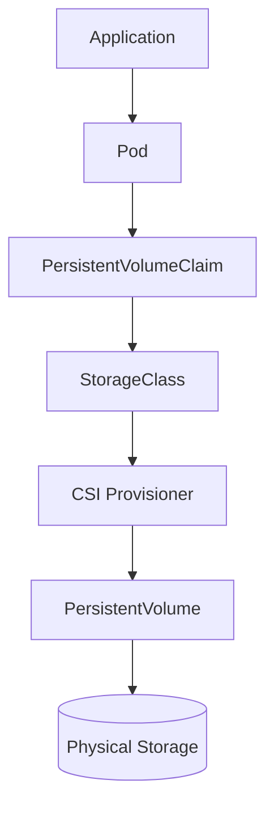

# Lab 06 - StorageClass

## Difficulty

⭐⭐⭐ Intermediate

## Estimated Time

30–40 minutes

---

# CKA Objectives Covered

* Inspect StorageClasses
* Create a PVC using a StorageClass
* Understand dynamic provisioning
* Verify automatic PV creation
* Understand the relationship between PVC, StorageClass, and PV

---

# Objective

In this lab, you will:

* View available StorageClasses.
* Identify the default StorageClass.
* Create a PVC that uses a StorageClass.
* Observe Kubernetes automatically creating a PersistentVolume.
* Mount the PVC into a Pod.

---

# Architecture



---

# What is a StorageClass?

A StorageClass tells Kubernetes **how** to provision storage.

It defines:

* Storage provisioner
* Parameters
* Reclaim policy
* Volume binding mode

With a StorageClass, administrators do not need to manually create PersistentVolumes.

---

# Step 1 - View StorageClasses

```bash
kubectl get storageclass
```

Short form:

```bash
kubectl get sc
```

Example:

```text
NAME                 PROVISIONER                          DEFAULT

standard (default)   rancher.io/local-path               Yes
```

Identify the default StorageClass.

---

# Step 2 - Describe the StorageClass

Replace `<storageclass-name>` with your default StorageClass.

```bash
kubectl describe sc <storageclass-name>
```

Observe:

* Provisioner
* Reclaim policy
* Volume binding mode

---

# Step 3 - Create a PVC

Create:

```text
dynamic-pvc.yaml
```

```yaml
apiVersion: v1
kind: PersistentVolumeClaim

metadata:
  name: dynamic-pvc

spec:
  accessModes:
    - ReadWriteOnce

  resources:
    requests:
      storage: 1Gi
```

> If your cluster does **not** have a default StorageClass, specify it explicitly:

```yaml
storageClassName: <storageclass-name>
```

Apply:

```bash
kubectl apply -f dynamic-pvc.yaml
```

---

# Step 4 - Verify Dynamic Provisioning

```bash
kubectl get pvc

kubectl get pv
```

Expected:

```text
PVC

dynamic-pvc

STATUS

Bound
```

A new PersistentVolume should appear automatically.

Unlike Lab 04, **you did not create the PV manually**.

---

# Step 5 - Inspect the PVC

```bash
kubectl describe pvc dynamic-pvc
```

Observe:

* Bound PV
* StorageClass
* Capacity
* Events

---

# Step 6 - Inspect the Automatically Created PV

```bash
kubectl get pv

kubectl describe pv <pv-name>
```

Notice:

* It references the StorageClass.
* It was automatically provisioned.

---

# Step 7 - Create a Pod

Create:

```text
pod-storageclass.yaml
```

```yaml
apiVersion: v1
kind: Pod

metadata:
  name: storageclass-demo

spec:
  containers:
  - name: app
    image: busybox:1.36
    command:
    - sh
    - -c
    - sleep 3600

    volumeMounts:
    - name: storage
      mountPath: /data

  volumes:
  - name: storage
    persistentVolumeClaim:
      claimName: dynamic-pvc
```

Apply:

```bash
kubectl apply -f pod-storageclass.yaml
```

---

# Step 8 - Verify the Pod

```bash
kubectl get pod storageclass-demo

kubectl describe pod storageclass-demo
```

Confirm:

* Pod is Running.
* PVC is mounted.

---

# Step 9 - Verify Persistent Storage

Connect:

```bash
kubectl exec -it storageclass-demo -- sh
```

Create a file:

```sh
echo "Dynamic Provisioning Works!" > /data/test.txt

cat /data/test.txt
```

Exit.

Delete the Pod:

```bash
kubectl delete pod storageclass-demo
```

Recreate it:

```bash
kubectl apply -f pod-storageclass.yaml
```

Reconnect:

```bash
kubectl exec -it storageclass-demo -- sh
```

Verify:

```sh
cat /data/test.txt
```

Expected:

```text
Dynamic Provisioning Works!
```

---

# Verification Checklist

✅ StorageClass identified.

✅ PVC created.

✅ PV created automatically.

✅ Pod mounted the PVC.

✅ Data persisted after Pod recreation.

---

# Common Errors

## PVC Stuck in Pending

Check:

```bash
kubectl get sc

kubectl describe pvc dynamic-pvc

kubectl get events --sort-by=.lastTimestamp
```

Possible causes:

* No default StorageClass
* Provisioner unavailable
* CSI driver issue

---

## No PV Created

Verify:

```bash
kubectl get sc

kubectl get csidriver
```

Dynamic provisioning requires a functioning provisioner.

---

## Pod Cannot Mount Storage

Verify:

```bash
kubectl get pvc

kubectl describe pod storageclass-demo
```

Ensure the PVC status is **Bound**.

---

# Production Discussion

Dynamic provisioning is the standard approach in production Kubernetes clusters.

Benefits:

* No manual PV creation.
* Automated storage allocation.
* Better scalability.
* Consistent provisioning across teams.

---

# Real World Notes

* Cloud providers usually install one or more StorageClasses.
* Most clusters define a default StorageClass.
* Applications generally request storage through PVCs and never interact directly with PVs.

---

# Static vs Dynamic Provisioning

| Static Provisioning     | Dynamic Provisioning         |
| ----------------------- | ---------------------------- |
| Admin creates PV        | Kubernetes creates PV        |
| Manual process          | Automatic process            |
| More operational effort | Easier to manage             |
| Good for fixed storage  | Preferred for most workloads |

---

# Knowledge Check

1. What is a StorageClass?
2. What is dynamic provisioning?
3. Who creates the PV during dynamic provisioning?
4. Why do modern clusters prefer StorageClasses?
5. What happens if there is no default StorageClass?

---

# Cleanup

```bash
kubectl delete pod storageclass-demo

kubectl delete pvc dynamic-pvc
```

> Depending on the StorageClass reclaim policy, the dynamically created PV may also be deleted automatically.

---

# Challenge

1. List all StorageClasses in your cluster.
2. Identify the default StorageClass.
3. Create a PVC using that StorageClass.
4. Verify that Kubernetes automatically creates a PV.
5. Mount the PVC into a Pod.
6. Write a file and verify it persists after Pod recreation.
7. Explain how dynamic provisioning differs from the manual PV creation process used in Lab 04.
