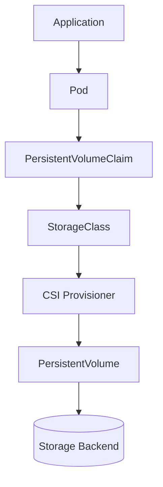

# Lab 07 - Dynamic Provisioning

## Difficulty

⭐⭐⭐⭐ Intermediate

## Estimated Time

30–40 minutes

---

# CKA Objectives Covered

* Understand dynamic provisioning
* Compare static and dynamic provisioning
* Create a PVC using a StorageClass
* Verify automatic PV creation
* Understand the complete provisioning workflow

---

# Objective

In this lab, you will:

* Compare static and dynamic provisioning.
* Create a PersistentVolumeClaim without manually creating a PersistentVolume.
* Observe Kubernetes automatically provisioning storage.
* Mount the dynamically provisioned storage into a Pod.
* Verify data persistence.

---

# Architecture



---

# Static vs Dynamic Provisioning

## Static Provisioning

```text
Administrator

↓

PersistentVolume

↓

PersistentVolumeClaim

↓

Pod
```

Administrator creates the PersistentVolume manually.

---

## Dynamic Provisioning

```text
PersistentVolumeClaim

↓

StorageClass

↓

CSI Provisioner

↓

PersistentVolume Created Automatically

↓

Pod
```

Kubernetes automatically creates the PersistentVolume.

---

# Step 1 - Verify the StorageClass

```bash
kubectl get storageclass

kubectl get sc
```

Example:

```text
NAME                 PROVISIONER

standard (default)   rancher.io/local-path
```

---

# Step 2 - Create a PVC

Create:

```text
dynamic-pvc.yaml
```

```yaml
apiVersion: v1
kind: PersistentVolumeClaim

metadata:
  name: dynamic-pvc

spec:
  accessModes:
    - ReadWriteOnce

  resources:
    requests:
      storage: 1Gi
```

> If your cluster does not have a default StorageClass, add:

```yaml
storageClassName: <your-storageclass>
```

Apply:

```bash
kubectl apply -f dynamic-pvc.yaml
```

---

# Step 3 - Observe Automatic PV Creation

Immediately check:

```bash
kubectl get pvc

kubectl get pv
```

Expected:

```text
PVC

dynamic-pvc

STATUS

Bound
```

A new PersistentVolume should appear automatically.

Unlike Lab 04, you did **not** create this PV manually.

---

# Step 4 - Inspect the PVC

```bash
kubectl describe pvc dynamic-pvc
```

Review:

* Status
* Capacity
* StorageClass
* Bound PersistentVolume
* Events

---

# Step 5 - Inspect the Automatically Created PV

```bash
kubectl get pv

kubectl describe pv <pv-name>
```

Observe:

* StorageClass
* Capacity
* Reclaim policy
* Provisioner annotations

Notice that Kubernetes created this resource automatically.

---

# Step 6 - Create a Pod

Create:

```text
dynamic-pod.yaml
```

```yaml
apiVersion: v1
kind: Pod

metadata:
  name: dynamic-demo

spec:
  containers:
  - name: app
    image: busybox:1.36
    command:
    - sh
    - -c
    - sleep 3600

    volumeMounts:
    - name: storage
      mountPath: /data

  volumes:
  - name: storage
    persistentVolumeClaim:
      claimName: dynamic-pvc
```

Apply:

```bash
kubectl apply -f dynamic-pod.yaml
```

---

# Step 7 - Verify the Pod

```bash
kubectl get pod dynamic-demo

kubectl describe pod dynamic-demo
```

Confirm:

* Pod is Running.
* PVC is mounted successfully.

---

# Step 8 - Test Persistent Storage

Connect:

```bash
kubectl exec -it dynamic-demo -- sh
```

Create a file:

```sh
echo "Dynamic Provisioning Success" > /data/demo.txt

cat /data/demo.txt
```

Exit.

Delete the Pod:

```bash
kubectl delete pod dynamic-demo
```

Recreate:

```bash
kubectl apply -f dynamic-pod.yaml
```

Reconnect:

```bash
kubectl exec -it dynamic-demo -- sh
```

Verify:

```sh
cat /data/demo.txt
```

Expected:

```text
Dynamic Provisioning Success
```

The data persists because it is stored on the dynamically provisioned PersistentVolume.

---

# Verification Checklist

✅ StorageClass verified.

✅ PVC created.

✅ PersistentVolume created automatically.

✅ Pod mounted the PVC.

✅ Data persisted after Pod recreation.

---

# Common Errors

## PVC Pending

Check:

```bash
kubectl describe pvc dynamic-pvc

kubectl get sc

kubectl get events --sort-by=.lastTimestamp
```

Possible causes:

* Missing StorageClass.
* Provisioner unavailable.
* CSI driver not running.

---

## No PV Created

Verify:

```bash
kubectl get sc

kubectl get csidriver
```

Dynamic provisioning requires a functioning provisioner.

---

## Pod Cannot Mount Volume

Verify:

```bash
kubectl describe pod dynamic-demo

kubectl get pvc
```

Ensure the PVC status is **Bound**.

---

# Production Discussion

Dynamic provisioning eliminates the need for administrators to manually create PersistentVolumes.

Benefits:

* Automated provisioning.
* Better scalability.
* Faster application deployment.
* Simplified storage management.

This is the preferred approach in modern Kubernetes environments.

---

# Real World Notes

Most managed Kubernetes platforms use dynamic provisioning by default.

Examples include:

* Amazon EKS
* Azure AKS
* Google GKE
* OpenShift
* Rancher
* Longhorn

---

# Knowledge Check

1. What is dynamic provisioning?
2. Which resource triggers automatic PV creation?
3. What role does the StorageClass play?
4. What creates the PersistentVolume?
5. Why is dynamic provisioning preferred over static provisioning?

---

# Cleanup

```bash
kubectl delete pod dynamic-demo

kubectl delete pvc dynamic-pvc
```

If the StorageClass uses a **Delete** reclaim policy, the automatically created PersistentVolume is also deleted.

---

# Challenge

1. Create a new PVC using the default StorageClass.
2. Verify Kubernetes automatically provisions a PersistentVolume.
3. Mount the PVC into a Pod.
4. Write a file to the volume.
5. Delete and recreate the Pod.
6. Verify the data still exists.
7. Compare this workflow with the static provisioning process from Lab 04.
