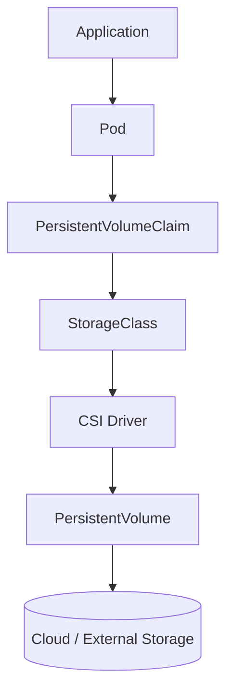

# Lab 08 - CSI (Container Storage Interface)

## Difficulty

⭐⭐⭐⭐ Intermediate

## Estimated Time

30–40 minutes

---

# CKA Objectives Covered

* Understand CSI architecture
* Inspect CSI drivers
* Verify CSI nodes
* Understand dynamic provisioning flow
* Observe CSI components in a cluster

---

# Objective

In this lab, you will:

* Inspect installed CSI drivers.
* Explore CSI node information.
* Understand how CSI integrates with StorageClasses.
* Observe how CSI enables dynamic provisioning.
* Trace the storage provisioning workflow.

---

# Architecture



---

# What is CSI?

CSI stands for **Container Storage Interface**.

It provides a standard interface between Kubernetes and external storage systems.

Examples:

* AWS EBS CSI
* Azure Disk CSI
* Google Persistent Disk CSI
* Ceph CSI
* NFS CSI
* Longhorn CSI

Instead of Kubernetes supporting every storage vendor directly, vendors implement the CSI specification.

---

# Step 1 - View Installed CSI Drivers

```bash id="4mfqze"
kubectl get csidriver
```

Example output:

```text id="x67k9k"
NAME

ebs.csi.aws.com

disk.csi.azure.com

pd.csi.storage.gke.io
```

Your cluster may display different drivers depending on the platform.

---

# Step 2 - Describe a CSI Driver

Replace `<driver-name>` with one from your cluster.

```bash id="5mbphg"
kubectl describe csidriver <driver-name>
```

Observe:

* Driver name
* Attach requirements
* Pod info on mount
* Storage capacity support

---

# Step 3 - View CSI Nodes

```bash id="lf49m6"
kubectl get csinode
```

Expected:

```text id="2qhf7z"
NAME

worker-node-1
```

Each Kubernetes node reports its available CSI drivers.

---

# Step 4 - Inspect a CSI Node

Replace `<node-name>` with one from your cluster.

```bash id="d5g7xp"
kubectl describe csinode <node-name>
```

Observe:

* Installed CSI drivers
* Driver topology
* Node information

---

# Step 5 - Review the StorageClass

```bash id="vnmj5v"
kubectl get sc

kubectl describe sc <storageclass-name>
```

Locate:

```text id="xnrj4f"
Provisioner
```

Example:

```text id="5m4y0r"
ebs.csi.aws.com
```

Notice that the StorageClass references the CSI provisioner.

---

# Step 6 - Observe Dynamic Provisioning

Create a PVC:

```yaml id="zjquhg"
apiVersion: v1
kind: PersistentVolumeClaim

metadata:
  name: csi-demo

spec:
  accessModes:
    - ReadWriteOnce

  resources:
    requests:
      storage: 1Gi
```

Apply:

```bash id="m48gdc"
kubectl apply -f csi-pvc.yaml
```

Verify:

```bash id="a2tm0g"
kubectl get pvc

kubectl get pv
```

Observe:

The CSI driver provisions a new PersistentVolume automatically (if your cluster supports dynamic provisioning).

---

# Step 7 - Trace the Provisioning Flow

Observe the complete workflow:

```text id="1o92do"
Application

↓

PersistentVolumeClaim

↓

StorageClass

↓

CSI Driver

↓

PersistentVolume

↓

Cloud / External Storage
```

This is how almost all modern Kubernetes clusters provision storage.

---

# Step 8 - Inspect Cluster Events

```bash id="kjw4az"
kubectl get events --sort-by=.lastTimestamp
```

Look for:

* Provisioning
* Successful binding
* Mount operations

---

# Verification Checklist

✅ CSI drivers listed.

✅ CSI node information reviewed.

✅ StorageClass inspected.

✅ Provisioner identified.

✅ PVC created.

✅ PV dynamically provisioned (if supported).

---

# Common Errors

## No CSI Drivers Found

Run:

```bash id="vk3gwj"
kubectl get csidriver
```

Some lightweight or local clusters may use built-in provisioners or different storage implementations.

---

## PVC Remains Pending

Check:

```bash id="b2g6el"
kubectl describe pvc csi-demo

kubectl get events --sort-by=.lastTimestamp
```

Possible causes:

* CSI provisioner unavailable.
* No default StorageClass.
* Storage backend unavailable.

---

## StorageClass Uses Unknown Provisioner

Verify:

```bash id="vv74gb"
kubectl describe sc <storageclass-name>
```

Ensure the referenced provisioner matches an installed CSI driver.

---

# Production Discussion

CSI provides:

* Vendor independence.
* Standardized storage integration.
* Dynamic provisioning.
* Snapshot support (driver dependent).
* Volume expansion (driver dependent).

Most production Kubernetes clusters use CSI for persistent storage.

---

# Real World Notes

Examples of CSI drivers:

| Platform          | Common CSI Driver                                   |
| ----------------- | --------------------------------------------------- |
| AWS               | EBS CSI                                             |
| Azure             | Azure Disk CSI                                      |
| Google Cloud      | GCE PD CSI                                          |
| On-premises       | Ceph CSI                                            |
| Local development | Local Path Provisioner / HostPath-based provisioner |

---

# Knowledge Check

1. What does CSI stand for?
2. Why was CSI introduced?
3. What resource references the CSI provisioner?
4. Which command lists installed CSI drivers?
5. Can Kubernetes dynamically provision storage without a compatible provisioner?

---

# Cleanup

```bash id="52fl7v"
kubectl delete pvc csi-demo
```

> If your StorageClass uses a `Delete` reclaim policy, the dynamically created PV will also be removed automatically.

---

# Challenge

1. List all CSI drivers in your cluster.
2. Identify which StorageClass uses each driver.
3. Create a PVC using the default StorageClass.
4. Verify a new PV is created automatically.
5. Trace the complete provisioning workflow from the PVC to the physical storage.
6. Explain why CSI made Kubernetes storage vendor-independent.
