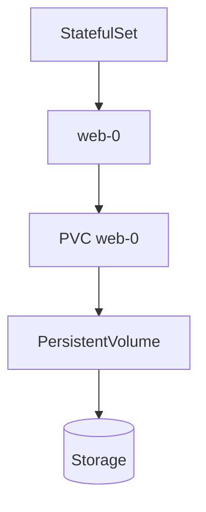

# Lab 09 - Stateful Application

## Difficulty

⭐⭐⭐⭐ Advanced

## Estimated Time

40–50 minutes

---

# CKA Objectives Covered

* Deploy a StatefulSet
* Understand stable Pod identities
* Create persistent storage using volumeClaimTemplates
* Verify persistent data across Pod recreation
* Understand StatefulSet storage behavior

---

# Objective

In this lab, you will:

* Deploy a StatefulSet.
* Automatically provision storage using `volumeClaimTemplates`.
* Write data to the application volume.
* Delete and recreate a Pod.
* Verify the data persists.

---

# Architecture



---

# What is a StatefulSet?

A StatefulSet manages stateful applications.

Unlike a Deployment, every Pod receives:

* A stable name
* A dedicated PersistentVolumeClaim
* Stable storage across restarts

Examples:

* PostgreSQL
* MySQL
* MongoDB
* Redis
* Elasticsearch

---

# Step 1 - Verify StorageClass

```bash
kubectl get storageclass

kubectl get sc
```

Ensure a default StorageClass exists.

---

# Step 2 - Create a Headless Service

Create:

```text
headless-service.yaml
```

```yaml
apiVersion: v1
kind: Service

metadata:
  name: nginx

spec:
  clusterIP: None

  selector:
    app: nginx

  ports:
  - port: 80
```

Apply:

```bash
kubectl apply -f headless-service.yaml
```

Verify:

```bash
kubectl get svc
```

---

# Step 3 - Create the StatefulSet

Create:

```text
statefulset.yaml
```

```yaml
apiVersion: apps/v1
kind: StatefulSet

metadata:
  name: web

spec:
  serviceName: nginx

  replicas: 1

  selector:
    matchLabels:
      app: nginx

  template:
    metadata:
      labels:
        app: nginx

    spec:
      containers:

      - name: nginx

        image: nginx

        volumeMounts:
        - name: web-storage
          mountPath: /usr/share/nginx/html

  volumeClaimTemplates:

  - metadata:
      name: web-storage

    spec:
      accessModes:
      - ReadWriteOnce

      resources:
        requests:
          storage: 1Gi
```

Apply:

```bash
kubectl apply -f statefulset.yaml
```

---

# Step 4 - Verify Resources

```bash
kubectl get statefulset

kubectl get pods

kubectl get pvc

kubectl get pv
```

Observe:

A new PVC is created automatically:

```text
web-storage-web-0
```

---

# Step 5 - Verify the Mounted Storage

Connect:

```bash
kubectl exec -it web-0 -- sh
```

Create a file:

```sh
echo "Stateful Kubernetes Storage" > /usr/share/nginx/html/index.html

cat /usr/share/nginx/html/index.html
```

Exit.

---

# Step 6 - Delete the Pod

```bash
kubectl delete pod web-0
```

The StatefulSet automatically recreates the Pod.

Wait:

```bash
kubectl get pods -w
```

---

# Step 7 - Verify Data Persistence

Reconnect:

```bash
kubectl exec -it web-0 -- sh
```

Verify:

```sh
cat /usr/share/nginx/html/index.html
```

Expected:

```text
Stateful Kubernetes Storage
```

The file still exists because the same PVC is reattached.

---

# Step 8 - Inspect the PVC

```bash
kubectl get pvc

kubectl describe pvc web-storage-web-0
```

Notice:

The PVC remains even though the Pod was recreated.

---

# Verification Checklist

✅ Headless Service created.

✅ StatefulSet created.

✅ PVC automatically created.

✅ PV automatically provisioned.

✅ File created.

✅ Pod deleted.

✅ Pod recreated.

✅ File still exists.

---

# Common Errors

## Pod Pending

Verify:

```bash
kubectl describe pod web-0
```

Possible causes:

* PVC Pending
* StorageClass missing
* CSI unavailable

---

## PVC Pending

Check:

```bash
kubectl get pvc

kubectl describe pvc web-storage-web-0

kubectl get sc
```

---

## Data Missing

Verify:

```bash
kubectl get pvc

kubectl describe pod web-0
```

Ensure the StatefulSet is using the generated PVC.

---

# Production Discussion

StatefulSets are designed for workloads that require:

* Stable network identities
* Persistent storage
* Ordered deployment
* Ordered scaling
* Ordered termination

Examples include:

* PostgreSQL
* MySQL
* MongoDB
* Redis
* Kafka
* Elasticsearch

---

# Deployment vs StatefulSet

| Deployment           | StatefulSet                 |
| -------------------- | --------------------------- |
| Stateless            | Stateful                    |
| Pods interchangeable | Pods have unique identities |
| Shared or no storage | Dedicated storage per Pod   |
| Random Pod names     | Stable Pod names            |

---

# Real World Notes

Each StatefulSet replica gets its own:

* Pod name
* PersistentVolumeClaim
* PersistentVolume

Example:

```text
web-0

↓

PVC web-storage-web-0

↓

PV
```

Scaling to three replicas creates:

```text
web-0

↓

PVC

web-1

↓

PVC

web-2

↓

PVC
```

Each replica has independent storage.

---

# Knowledge Check

1. Why do StatefulSets use Headless Services?
2. What is `volumeClaimTemplates`?
3. Does every StatefulSet replica receive its own PVC?
4. What happens when a StatefulSet Pod is recreated?
5. Why are Deployments not suitable for databases?

---

# Cleanup

```bash
kubectl delete statefulset web

kubectl delete svc nginx

kubectl delete pvc --all
```

Depending on your StorageClass reclaim policy, the PersistentVolumes may also be deleted automatically.

---

# Challenge

1. Scale the StatefulSet to **3 replicas**.
2. Verify three Pods are created.
3. Verify three PVCs are created automatically.
4. Write different files to each Pod.
5. Delete **web-1**.
6. Verify the recreated **web-1** still has its original data.
7. Explain why each StatefulSet Pod has its own dedicated storage.
