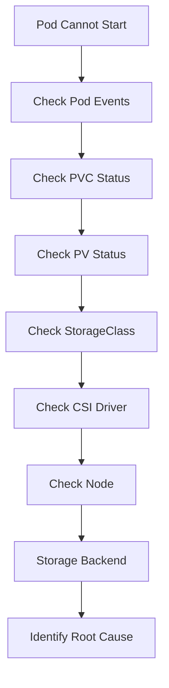

# Lab 10 - Storage Troubleshooting

## Difficulty

⭐⭐⭐⭐⭐ Expert

## Estimated Time

45–60 minutes

---

# CKA Objectives Covered

* Troubleshoot PersistentVolumes
* Troubleshoot PersistentVolumeClaims
* Troubleshoot StorageClasses
* Troubleshoot CSI drivers
* Troubleshoot Pod mount failures
* Apply a structured storage troubleshooting workflow

---

# Objective

In this lab, you will troubleshoot common Kubernetes storage issues using a systematic approach.

By the end of this lab, you should be able to diagnose most storage-related failures in Kubernetes.

---

# Production Troubleshooting Workflow



---

# Lab Environment

Create a simple workload.

```yaml
apiVersion: v1
kind: PersistentVolumeClaim

metadata:
  name: troubleshoot-pvc

spec:
  accessModes:
  - ReadWriteOnce

  resources:
    requests:
      storage: 1Gi
```

Apply:

```bash
kubectl apply -f pvc.yaml
```

Create a Pod:

```yaml
apiVersion: v1
kind: Pod

metadata:
  name: storage-demo

spec:
  containers:

  - name: app

    image: busybox:1.36

    command:
    - sh
    - -c
    - sleep 3600

    volumeMounts:

    - name: storage

      mountPath: /data

  volumes:

  - name: storage

    persistentVolumeClaim:

      claimName: troubleshoot-pvc
```

Apply:

```bash
kubectl apply -f pod.yaml
```

---

# Scenario 1 - PVC Stuck in Pending

## Symptoms

```text
kubectl get pvc

STATUS

Pending
```

---

## Investigation

```bash
kubectl describe pvc troubleshoot-pvc

kubectl get sc

kubectl get pv

kubectl get events --sort-by=.lastTimestamp
```

---

## Possible Causes

* Missing StorageClass
* No matching PersistentVolume
* CSI unavailable
* Capacity mismatch
* Access mode mismatch

---

## Resolution

Verify:

* StorageClass
* Available PVs
* CSI provisioner
* Requested storage

---

# Scenario 2 - Pod Stuck in ContainerCreating

## Symptoms

```text
STATUS

ContainerCreating
```

---

## Investigation

```bash
kubectl describe pod storage-demo
```

Look for:

```text
FailedMount
```

---

## Resolution

Verify:

* PVC status
* PV status
* Storage backend
* CSI driver

---

# Scenario 3 - FailedMount Errors

## Investigation

```bash
kubectl describe pod storage-demo

kubectl get events
```

---

## Common Causes

* Storage unavailable
* Wrong access mode
* Node cannot attach volume
* CSI failure

---

# Scenario 4 - Data Lost

## Symptoms

Application restarts.

Previous data disappears.

---

## Investigation

```bash
kubectl get pod storage-demo -o yaml
```

Verify the mounted volume.

---

## Root Cause

Application uses:

* Container filesystem
* emptyDir

instead of a PVC.

---

## Resolution

Use a PersistentVolumeClaim.

---

# Scenario 5 - Access Mode Conflict

Example:

Two Pods attempt to mount:

```text
ReadWriteOnce
```

on different nodes.

---

## Investigation

```bash
kubectl describe pvc

kubectl describe pv
```

---

## Resolution

Use:

* ReadWriteMany storage
* Or redesign the workload

---

# Scenario 6 - StorageClass Problems

## Investigation

```bash
kubectl get sc

kubectl describe sc
```

---

## Possible Problems

* Wrong provisioner
* No default StorageClass
* Missing CSI driver

---

# Scenario 7 - CSI Driver Problems

## Investigation

```bash
kubectl get csidriver

kubectl get csinode

kubectl get events
```

---

## Resolution

Verify:

* CSI controller Pods
* CSI node Pods
* Storage backend connectivity

---

# Scenario 8 - StatefulSet Storage

Delete:

```bash
kubectl delete pod web-0
```

Observe:

```bash
kubectl get pvc
```

Notice:

The PVC remains.

Reconnect:

```bash
kubectl exec -it web-0 -- sh
```

Verify:

```sh
cat /usr/share/nginx/html/index.html
```

Data is still present.

---

# Scenario 9 - Reclaim Policy

Verify:

```bash
kubectl describe pv
```

Observe:

```text
Reclaim Policy
```

Compare:

* Delete
* Retain

Understand how each policy affects storage cleanup.

---

# Scenario 10 - Complete Storage Verification

Run:

```bash
kubectl get pv

kubectl get pvc

kubectl get sc

kubectl get csidriver

kubectl describe pod storage-demo

kubectl get events --sort-by=.lastTimestamp
```

This sequence should become your default troubleshooting workflow.

---

# Verification Checklist

✅ PVC verified.

✅ PV verified.

✅ StorageClass verified.

✅ CSI verified.

✅ Pod mounts verified.

✅ Stateful storage verified.

✅ Reclaim policy understood.

---

# Production Storage Checklist

Always verify:

1. Pod Events
2. PVC Status
3. PV Status
4. StorageClass
5. CSI Driver
6. Node
7. Storage Backend

Never start by editing YAML files.

---

# Common Troubleshooting Commands

```bash
kubectl get pv

kubectl get pvc

kubectl get sc

kubectl get csidriver

kubectl get csinode

kubectl describe pvc

kubectl describe pv

kubectl describe pod

kubectl get events --sort-by=.lastTimestamp

kubectl exec -it <pod-name> -- df -h

kubectl exec -it <pod-name> -- mount
```

---

# Common Storage Problems

| Problem              | Likely Cause                           |
| -------------------- | -------------------------------------- |
| PVC Pending          | StorageClass or PV issue               |
| FailedMount          | CSI or node issue                      |
| Data lost            | Using emptyDir or container filesystem |
| Pod Pending          | PVC not bound                          |
| Read-only filesystem | Access mode mismatch                   |
| No PV created        | Dynamic provisioning failure           |

---

# Knowledge Check

1. What should you check first when a Pod cannot mount storage?
2. Why would a PVC remain in Pending?
3. What causes FailedMount errors?
4. Why does data disappear when using emptyDir?
5. How do you verify a CSI driver is installed?
6. What is the difference between Delete and Retain reclaim policies?

---

# Cleanup

```bash
kubectl delete pod storage-demo

kubectl delete pvc troubleshoot-pvc

kubectl delete statefulset web

kubectl delete svc nginx
```

Delete any remaining PersistentVolumes if your reclaim policy is **Retain**.

---

# Final Challenge

A production database is unavailable.

Symptoms:

* Pod is stuck in `ContainerCreating`.
* PVC is `Pending`.
* No PersistentVolume exists.

Your task:

1. Identify the root cause.
2. Explain the troubleshooting workflow.
3. List the commands you would execute.
4. Fix the issue.
5. Verify the database starts successfully.

---

# Chapter Summary

Congratulations! 🎉

You have completed the **Storage** chapter.

You now understand:

* Volumes
* emptyDir
* hostPath
* PersistentVolumes
* PersistentVolumeClaims
* StorageClasses
* Dynamic Provisioning
* CSI
* Stateful Applications
* Production Storage Troubleshooting

These concepts are essential for the CKA exam and for managing stateful workloads in production Kubernetes clusters.
