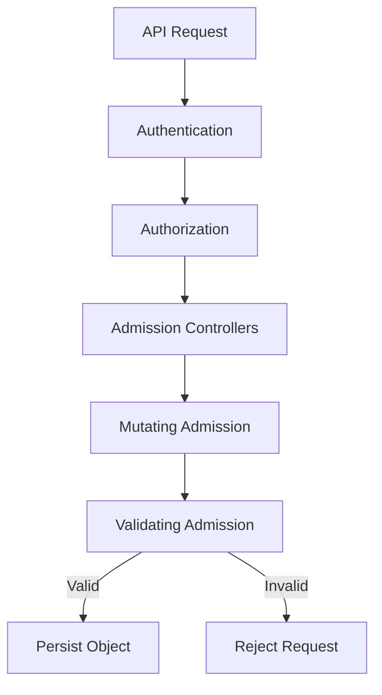

# Admission Controllers

```mermaid
flowchart TD
    Request[API Request]
    AuthN[Authentication]
    AuthZ[Authorization]
    Admission[Admission Controllers]
    Mutating[Mutating Admission]
    Validating[Validating Admission]
    Persist[Persist Object]
    Reject[Reject Request]

    Request --> AuthN
    AuthN --> AuthZ
    AuthZ --> Admission
    Admission --> Mutating
    Mutating --> Validating
    Validating -->|Valid| Persist
    Validating -->|Invalid| Reject
```

## Key Point

Admission Controllers can mutate or validate requests before Kubernetes stores objects.
