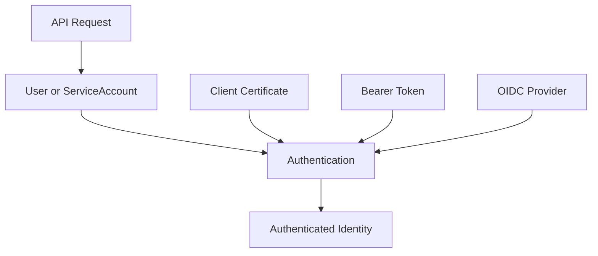

# Authentication

```mermaid
flowchart TD
    Request[API Request]
    Identity[User or ServiceAccount]
    AuthN[Authentication]
    Cert[Client Certificate]
    Token[Bearer Token]
    OIDC[OIDC Provider]
    Result[Authenticated Identity]

    Request --> Identity
    Identity --> AuthN
    Cert --> AuthN
    Token --> AuthN
    OIDC --> AuthN
    AuthN --> Result
```

## Key Point

Authentication verifies identity and answers: **Who are you?**
