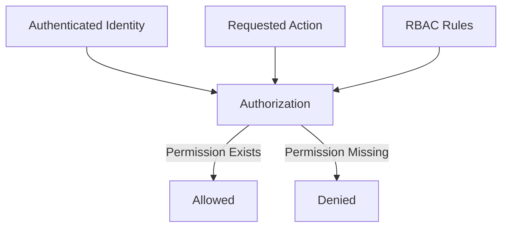

# Authorization

```mermaid
flowchart TD
    Identity[Authenticated Identity]
    Request[Requested Action]
    AuthZ[Authorization]
    RBAC[RBAC Rules]
    Allowed[Allowed]
    Denied[Denied]

    Identity --> AuthZ
    Request --> AuthZ
    RBAC --> AuthZ
    AuthZ -->|Permission Exists| Allowed
    AuthZ -->|Permission Missing| Denied
```

## Key Point

Authorization checks permissions and answers: **What are you allowed to do?**
