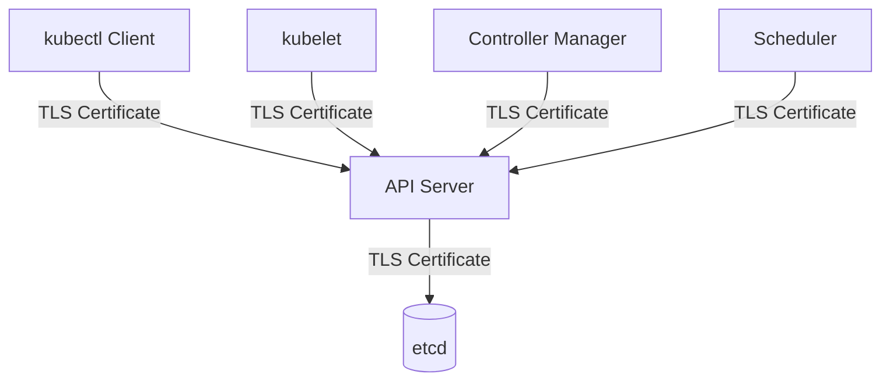

# Certificates

```mermaid
flowchart TD
    Kubectl[kubectl Client]
    APIServer[API Server]
    Kubelet[kubelet]
    Controller[Controller Manager]
    Scheduler[Scheduler]
    Etcd[(etcd)]

    Kubectl -->|TLS Certificate| APIServer
    Kubelet -->|TLS Certificate| APIServer
    Controller -->|TLS Certificate| APIServer
    Scheduler -->|TLS Certificate| APIServer
    APIServer -->|TLS Certificate| Etcd
```

## Key Point

Kubernetes components use TLS certificates to authenticate and encrypt communication.
