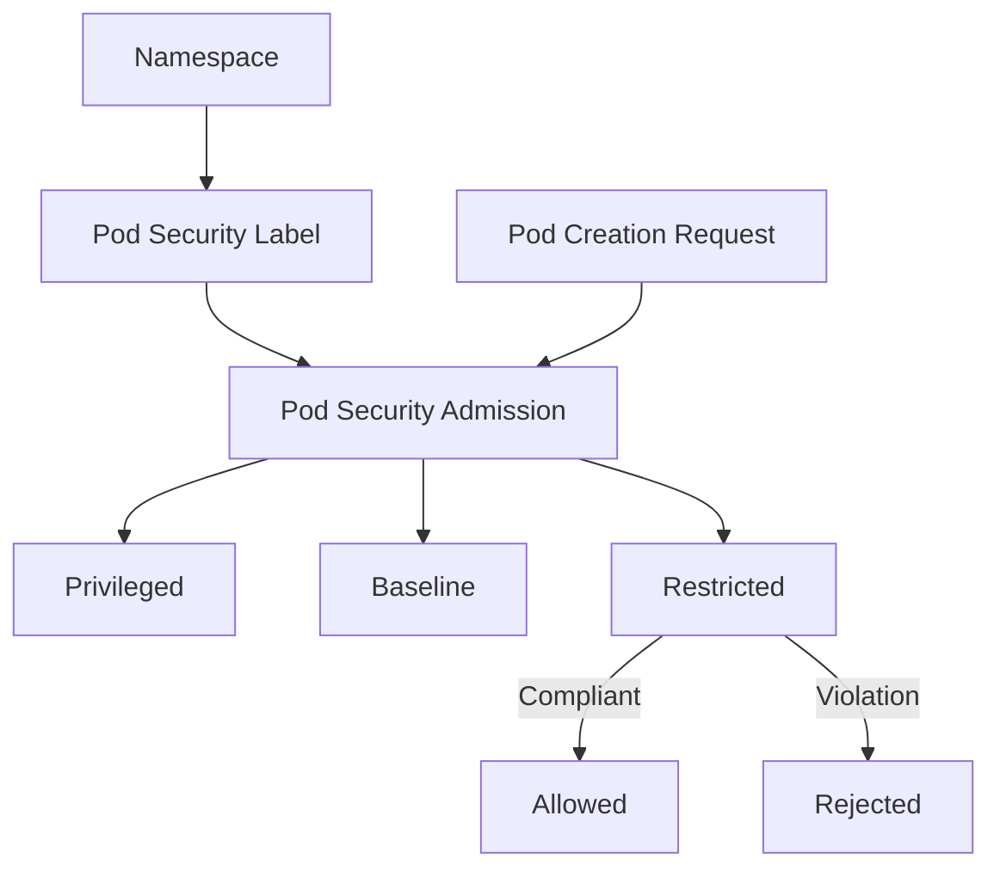

# Pod Security

```mermaid
flowchart TD
    Namespace[Namespace]
    Label[Pod Security Label]
    Admission[Pod Security Admission]
    Pod[Pod Creation Request]
    Privileged[Privileged]
    Baseline[Baseline]
    Restricted[Restricted]
    Allowed[Allowed]
    Rejected[Rejected]

    Namespace --> Label
    Label --> Admission
    Pod --> Admission

    Admission --> Privileged
    Admission --> Baseline
    Admission --> Restricted

    Restricted -->|Compliant| Allowed
    Restricted -->|Violation| Rejected
```

## Key Point

Pod Security Standards are enforced at the namespace level using Pod Security Admission labels.
