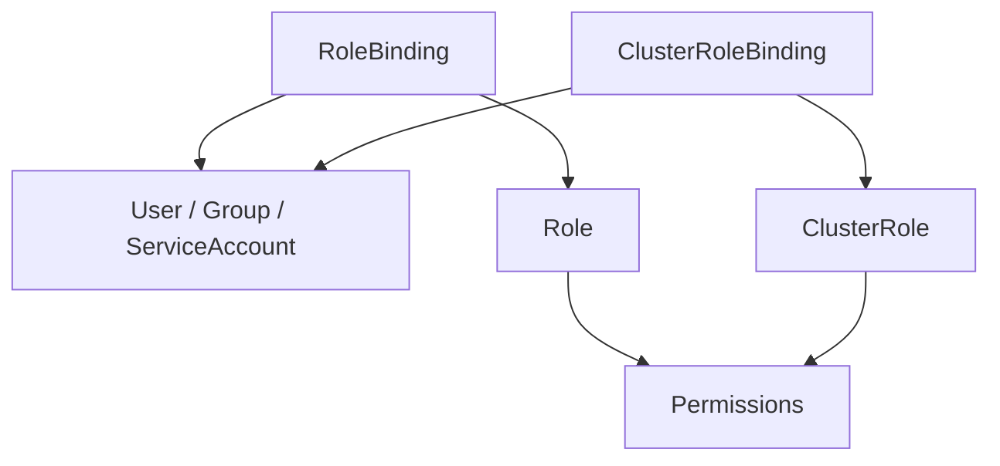

# RBAC

```mermaid
flowchart TD
    Subject[User / Group / ServiceAccount]
    Role[Role]
    ClusterRole[ClusterRole]
    RoleBinding[RoleBinding]
    ClusterRoleBinding[ClusterRoleBinding]
    Permissions[Permissions]

    Role --> Permissions
    ClusterRole --> Permissions

    RoleBinding --> Subject
    RoleBinding --> Role

    ClusterRoleBinding --> Subject
    ClusterRoleBinding --> ClusterRole
```

## Key Point

RBAC grants permissions by binding users or ServiceAccounts to Roles or ClusterRoles.
