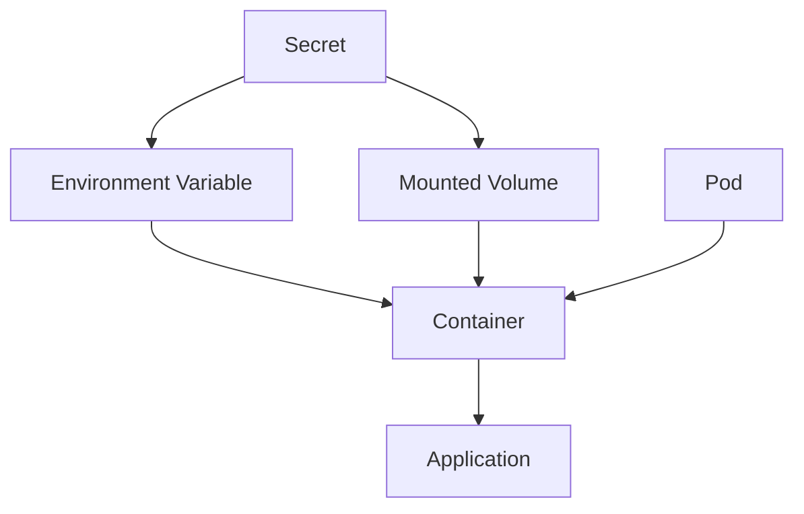

# Secrets

```mermaid
flowchart TD
    Secret[Secret]
    Env[Environment Variable]
    Volume[Mounted Volume]
    Pod[Pod]
    Container[Container]
    Application[Application]

    Secret --> Env
    Secret --> Volume
    Env --> Container
    Volume --> Container
    Pod --> Container
    Container --> Application
```

## Key Point

Secrets store sensitive data and can be consumed by Pods as environment variables or mounted files.
