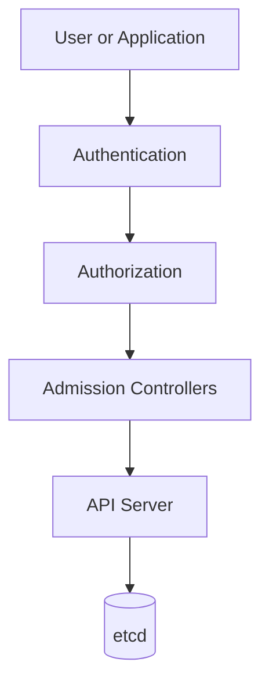

# Security Overview

```mermaid
flowchart TD
    User[User or Application]
    AuthN[Authentication]
    AuthZ[Authorization]
    Admission[Admission Controllers]
    APIServer[API Server]
    Etcd[(etcd)]

    User --> AuthN
    AuthN --> AuthZ
    AuthZ --> Admission
    Admission --> APIServer
    APIServer --> Etcd
```

## Key Point

Every Kubernetes API request passes through authentication, authorization, and admission control before being stored.
