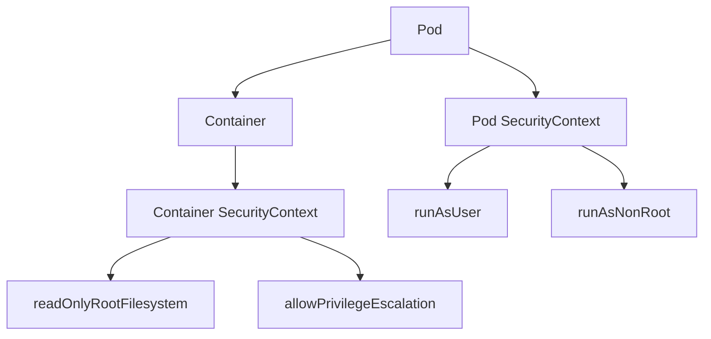

# Security Context

```mermaid
flowchart TD
    Pod[Pod]
    PodSecurityContext[Pod SecurityContext]
    Container[Container]
    ContainerSecurityContext[Container SecurityContext]

    RunAsUser[runAsUser]
    RunAsNonRoot[runAsNonRoot]
    ReadOnlyRootFS[readOnlyRootFilesystem]
    PrivEsc[allowPrivilegeEscalation]

    Pod --> PodSecurityContext
    Pod --> Container
    Container --> ContainerSecurityContext

    PodSecurityContext --> RunAsUser
    PodSecurityContext --> RunAsNonRoot
    ContainerSecurityContext --> ReadOnlyRootFS
    ContainerSecurityContext --> PrivEsc
```

## Key Point

Security Contexts define runtime security settings for Pods and containers.
