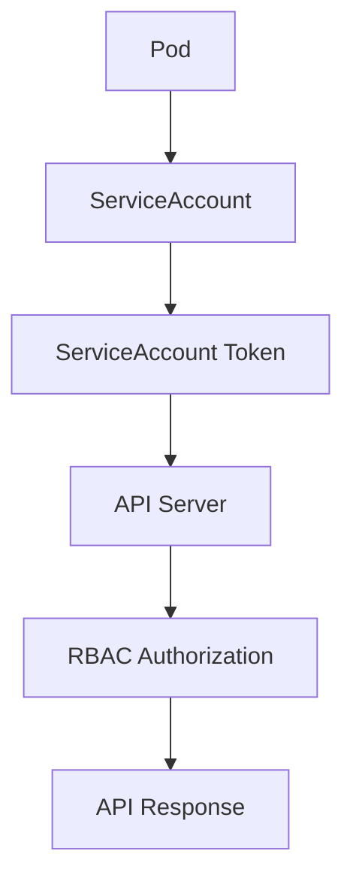

# ServiceAccounts

```mermaid
flowchart TD
    Pod[Pod]
    ServiceAccount[ServiceAccount]
    Token[ServiceAccount Token]
    APIServer[API Server]
    RBAC[RBAC Authorization]
    Response[API Response]

    Pod --> ServiceAccount
    ServiceAccount --> Token
    Token --> APIServer
    APIServer --> RBAC
    RBAC --> Response
```

## Key Point

ServiceAccounts provide Kubernetes API identity for Pods.
