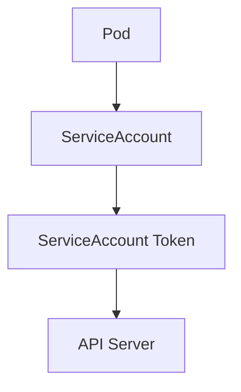

# Lab 01 - ServiceAccounts

## Difficulty

⭐ Beginner

## Estimated Time

20–30 minutes

---

# CKA Objectives Covered

* Create a ServiceAccount
* Assign a ServiceAccount to a Pod
* Inspect the assigned ServiceAccount
* Understand Pod identity
* Verify ServiceAccount token mounting

---

# Objective

In this lab, you will:

* Create a ServiceAccount.
* Create a Pod that uses it.
* Verify the Pod's identity.
* Inspect the mounted ServiceAccount token.
* Understand why ServiceAccounts are required.

---

# Architecture



---

# What is a ServiceAccount?

A ServiceAccount provides an identity for applications running inside Kubernetes.

It is used when a Pod needs to communicate with the Kubernetes API.

Every namespace has a default ServiceAccount, but production applications should normally use dedicated ServiceAccounts.

---

# Step 1 - View Existing ServiceAccounts

```bash
kubectl get sa

kubectl get serviceaccounts
```

Expected:

```text
NAME      SECRETS   AGE

default   0         5d
```

> **Note:** On newer Kubernetes versions, the `SECRETS` column may show `0` because tokens are projected into Pods instead of stored as long-lived Secret objects.

---

# Step 2 - Create a ServiceAccount

```bash
kubectl create serviceaccount demo-sa
```

Verify:

```bash
kubectl get sa
```

Expected:

```text
NAME

default

demo-sa
```

---

# Step 3 - Describe the ServiceAccount

```bash
kubectl describe sa demo-sa
```

Review:

* Name
* Namespace
* Labels
* Mountable secrets (if any)

---

# Step 4 - Create a Pod Using the ServiceAccount

Create:

```text
serviceaccount-pod.yaml
```

```yaml
apiVersion: v1
kind: Pod

metadata:
  name: sa-demo

spec:
  serviceAccountName: demo-sa

  containers:
  - name: app
    image: busybox:1.36
    command:
    - sh
    - -c
    - sleep 3600
```

Apply:

```bash
kubectl apply -f serviceaccount-pod.yaml
```

---

# Step 5 - Verify the Pod

```bash
kubectl get pod sa-demo

kubectl describe pod sa-demo
```

Locate:

```text
Service Account: demo-sa
```

---

# Step 6 - Verify the ServiceAccount Inside the Pod

Connect:

```bash
kubectl exec -it sa-demo -- sh
```

List the projected ServiceAccount files:

```sh
ls -R /var/run/secrets/kubernetes.io/serviceaccount
```

Typical output:

```text
ca.crt
namespace
token
```

Display the namespace:

```sh
cat /var/run/secrets/kubernetes.io/serviceaccount/namespace
```

Display the token length (don't print the whole token in production):

```sh
wc -c /var/run/secrets/kubernetes.io/serviceaccount/token
```

Exit:

```sh
exit
```

---

# Step 7 - Compare with the Default ServiceAccount

Create another Pod without specifying a ServiceAccount:

```yaml
apiVersion: v1
kind: Pod

metadata:
  name: default-sa-demo

spec:
  containers:
  - name: app
    image: busybox:1.36
    command:
    - sh
    - -c
    - sleep 3600
```

Apply:

```bash
kubectl apply -f default-sa-pod.yaml
```

Verify:

```bash
kubectl describe pod default-sa-demo
```

Notice:

```text
Service Account: default
```

---

# Verification Checklist

✅ ServiceAccount created.

✅ Pod uses the custom ServiceAccount.

✅ ServiceAccount token projected into the Pod.

✅ Pod identity verified.

✅ Difference between default and custom ServiceAccounts understood.

---

# Common Errors

## ServiceAccount Not Found

```text
serviceaccount "demo-sa" not found
```

Verify:

```bash
kubectl get sa
```

Ensure the ServiceAccount exists in the same namespace as the Pod.

---

## Wrong ServiceAccount Assigned

Check:

```bash
kubectl describe pod sa-demo
```

Verify:

```text
Service Account: demo-sa
```

---

## Token Files Missing

Verify:

```bash
kubectl exec -it sa-demo -- ls \
/var/run/secrets/kubernetes.io/serviceaccount
```

If token automounting has been disabled, the projected files may not be present.

---

# Production Discussion

Best practices:

* Create one ServiceAccount per application.
* Do not rely on the default ServiceAccount for production workloads.
* Grant only the minimum permissions required through RBAC.
* Disable automatic token mounting for Pods that do not need Kubernetes API access.

Example:

```yaml
automountServiceAccountToken: false
```

---

# Real World Notes

A ServiceAccount provides **identity**, not **permissions**.

Permissions are granted later through:

* Role + RoleBinding
* ClusterRole + ClusterRoleBinding

This separation allows identity and authorization to be managed independently.

---

# Knowledge Check

1. What is a ServiceAccount?
2. Why should production applications avoid the default ServiceAccount?
3. Where is the ServiceAccount token mounted inside a Pod?
4. Does a ServiceAccount automatically grant permissions?
5. Which field assigns a ServiceAccount to a Pod?

---

# Cleanup

```bash
kubectl delete pod sa-demo

kubectl delete pod default-sa-demo

kubectl delete sa demo-sa
```

---

# Challenge

1. Create a new ServiceAccount named `web-sa`.
2. Create a Pod that uses `web-sa`.
3. Verify the assigned ServiceAccount.
4. Inspect the projected ServiceAccount files inside the Pod.
5. Disable automatic token mounting by setting:

```yaml
automountServiceAccountToken: false
```

6. Recreate the Pod and verify that the projected token files are no longer mounted.
