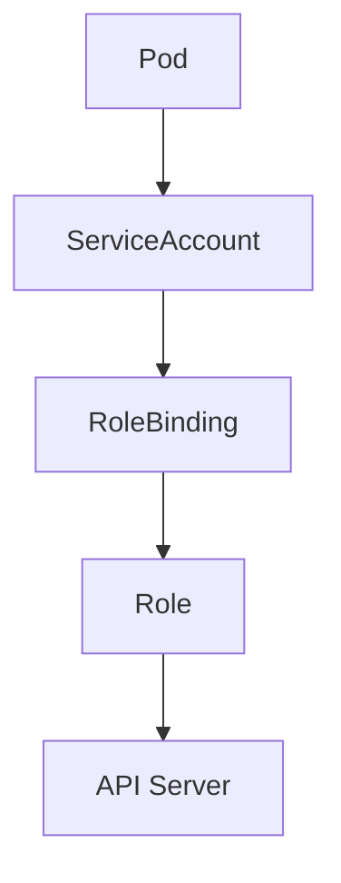

# Lab 02 - RBAC (Role-Based Access Control)

## Difficulty

⭐⭐ Intermediate

## Estimated Time

30–40 minutes

---

# CKA Objectives Covered

* Create a Role
* Create a RoleBinding
* Grant permissions to a ServiceAccount
* Verify permissions using `kubectl auth can-i`
* Understand namespace-scoped authorization

---

# Objective

In this lab, you will:

* Create a ServiceAccount.
* Create a Role.
* Bind the Role to the ServiceAccount.
* Verify the granted permissions.
* Understand how RBAC controls access to Kubernetes resources.

---

# Architecture



---

# RBAC Workflow

RBAC follows this flow:

```text
ServiceAccount

↓

Role

↓

RoleBinding

↓

Permissions
```

A ServiceAccount provides identity.

A Role defines permissions.

A RoleBinding connects the identity to the permissions.

---

# Step 1 - Create a ServiceAccount

```bash
kubectl create serviceaccount developer-sa
```

Verify:

```bash
kubectl get sa
```

---

# Step 2 - Create a Role

Create:

```text
pod-reader-role.yaml
```

```yaml
apiVersion: rbac.authorization.k8s.io/v1
kind: Role

metadata:
  name: pod-reader

rules:

- apiGroups:
  - ""

  resources:
  - pods

  verbs:
  - get
  - list
  - watch
```

Apply:

```bash
kubectl apply -f pod-reader-role.yaml
```

Verify:

```bash
kubectl get role
```

---

# Step 3 - Describe the Role

```bash
kubectl describe role pod-reader
```

Observe:

* Resources
* Verbs
* API Groups

---

# Step 4 - Create a RoleBinding

Create:

```text
pod-reader-binding.yaml
```

```yaml
apiVersion: rbac.authorization.k8s.io/v1
kind: RoleBinding

metadata:
  name: pod-reader-binding

subjects:

- kind: ServiceAccount
  name: developer-sa

roleRef:

  kind: Role

  name: pod-reader

  apiGroup: rbac.authorization.k8s.io
```

Apply:

```bash
kubectl apply -f pod-reader-binding.yaml
```

Verify:

```bash
kubectl get rolebinding
```

---

# Step 5 - Verify Permissions

Test:

```bash
kubectl auth can-i get pods \
--as=system:serviceaccount:default:developer-sa
```

Expected:

```text
yes
```

Now test another permission:

```bash
kubectl auth can-i delete pods \
--as=system:serviceaccount:default:developer-sa
```

Expected:

```text
no
```

The ServiceAccount has only the permissions granted by the Role.

---

# Step 6 - Verify Additional Permissions

```bash
kubectl auth can-i list pods \
--as=system:serviceaccount:default:developer-sa

kubectl auth can-i watch pods \
--as=system:serviceaccount:default:developer-sa

kubectl auth can-i create pods \
--as=system:serviceaccount:default:developer-sa
```

Expected:

| Command     | Result |
| ----------- | ------ |
| get pods    | ✅ yes  |
| list pods   | ✅ yes  |
| watch pods  | ✅ yes  |
| create pods | ❌ no   |

---

# Step 7 - View the Resources

```bash
kubectl get role pod-reader -o yaml

kubectl get rolebinding pod-reader-binding -o yaml
```

Observe:

* Rules
* Subjects
* Role reference

---

# Verification Checklist

✅ ServiceAccount created.

✅ Role created.

✅ RoleBinding created.

✅ Permissions verified.

✅ Unauthorized actions denied.

---

# Common Errors

## Forbidden

Example:

```text
Error from server (Forbidden)
```

Check:

```bash
kubectl auth can-i get pods \
--as=system:serviceaccount:default:developer-sa
```

---

## RoleBinding References Wrong Role

Verify:

```bash
kubectl describe rolebinding pod-reader-binding
```

Ensure:

* Correct Role name.
* Correct namespace.
* Correct ServiceAccount.

---

## ServiceAccount Not Found

```bash
kubectl get sa
```

Ensure the ServiceAccount exists in the same namespace as the RoleBinding.

---

# Production Discussion

RBAC follows the **Principle of Least Privilege**.

Instead of granting broad permissions:

❌ Allow everything

Grant only what the application requires.

Examples:

* Read Pods only.
* Read ConfigMaps only.
* Update Deployments only.
* Read Secrets only when necessary.

---

# Real World Notes

RBAC resources:

| Resource           | Scope     |
| ------------------ | --------- |
| Role               | Namespace |
| ClusterRole        | Cluster   |
| RoleBinding        | Namespace |
| ClusterRoleBinding | Cluster   |

Most applications only need **Roles** and **RoleBindings**.

---

# Knowledge Check

1. What does a Role define?
2. What does a RoleBinding do?
3. Does a ServiceAccount automatically receive permissions?
4. Which command verifies permissions?
5. When should you use a ClusterRole instead of a Role?

---

# Cleanup

```bash
kubectl delete rolebinding pod-reader-binding

kubectl delete role pod-reader

kubectl delete sa developer-sa
```

---

# Challenge

1. Create a ServiceAccount named `viewer-sa`.
2. Create a Role that allows reading ConfigMaps.
3. Bind the Role to `viewer-sa`.
4. Verify:

```bash
kubectl auth can-i get configmaps \
--as=system:serviceaccount:default:viewer-sa
```

5. Verify that `viewer-sa` **cannot delete ConfigMaps**.
6. Modify the Role to allow creating ConfigMaps.
7. Verify the new permission using `kubectl auth can-i`.
